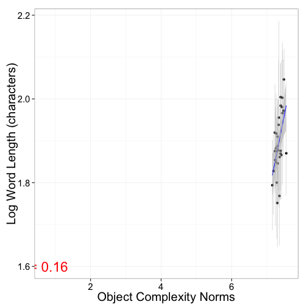
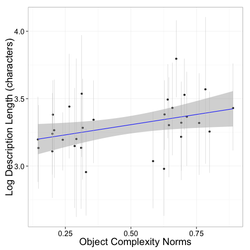
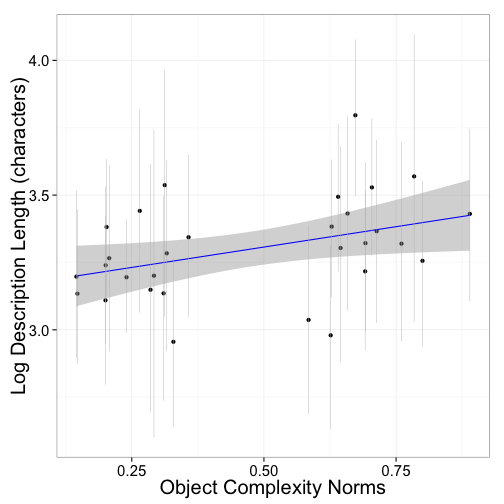
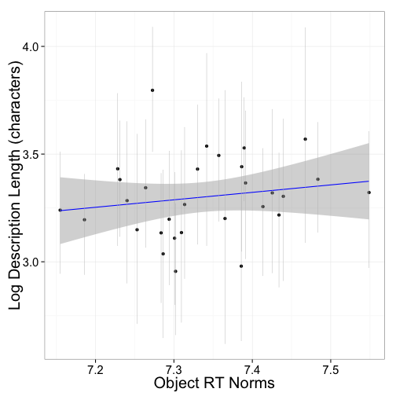

Referential Complexity Analyses
================================
M. Lewis 

August 22, 2014

***
***

<h2> Analyses:<h2>

1. [Cross-linguistic analyses](#google) <br/> 
  (A) [Complexity Norms](#1a) <br/>
  (B) [Correlation between all lengths](#1b) <br/> 
  (C) [Correlation between all lengths, controling for frequency, open class only](#1c) <br/> 
  (D) [Correlation between all lengths and complexity, controling for frequency](#1d) <br/> 
  (E) [Translation check data](#1e) <br/> 
  
2. [High frequency words in mapping task](#HF)

3. [Novel real objects](#novelRealObjs)<br/> 
  (A) [Norms](#3a)<br/> 
  (B) [Mappping task (adults)](#3b) <br/> 
  (C) [Mapping task (children)](#3c) TO DO <br/> 
  (D) [Production task (labels + descriptions)](#3d) <br/> 

4. [Geons](#geons) <br/> 
  (A) [Norms](#4a) <br/> 
  (B) [Mappping task](#4b)<br/>

* figure out how to clear before start new experiment
* clean up so that only see plots and critical statistical results
* check that all experients remove duplicates

#### SET GLOBAL VARIABLES

```r
rm(list=ls())

whichSubjRemove = 'keepAll' #remove repeat subjects? ('keepAll', 'repeatSubj', 'withinRepeatSubj')
processNorms = TRUE # process norms or load norms? 
savePlots = TRUE # save plots to pdf?
doSlow = TRUE # do time-consuming pre-processing steps?
```

#### LOAD PACKAGES, FUNCTIONS, AND REPEAT SUBJ DATA FILE


***
***

<a name="google"/>

## (1) Cross-linguistic analyses [(Complexity norms task)][task26]

<a name="1a"/>
###  (A) Norms

* preprocess


* read in xling data and merge with English complexity norms


* look at words by class
 

* look at accuracy for translations checks
+ preprocess


+ plot and stats
+  accuracy

```
## Error: object 'accuracy' not found
```

```
## Error: object 'dfa' not found
```

```
## Error: object 'dfa' not found
```

```
## [1] "total accuracy: 0.919004676018704"
```

```
## Error: error in evaluating the argument 'x' in selecting a method for function 'print': Error in mean(open_accuracy) : 
##   error in evaluating the argument 'x' in selecting a method for function 'mean': Error: object 'open_accuracy' not found
## Calls: paste -> mean
```

```
## [1] "open_bare_accuracy: 0.92296389588581"
```

<a name="1b"/>
###  (B) Correlation between all lengths

```r
lens = c(which(grepl("LEN",names(xling)))) # get length column indices
col1 <- colorRampPalette(c("blue", "white" , "red"))

## Correlations between all lengths, all words
xling_len = xling[, lens] 
names(xling_len) = as.character(tolower(lapply(str_split(names(xling_len),"_"),function(x) {x[1]})))

# Correlations between all lengths
cmat = cor(xling_len, use = "pairwise.complete.obs")
corrplot(cmat,  tl.cex=.5, tl.srt=45, method = "color", tl.col = "black" ,col =col1(100),order = "FPC")
```

 

```r
mean(cmat)
```

```
## [1] 0.3213
```

```r
## Correlations between all lengths, open class words only
xlingO = xling[xling$Open_class != 0,lens] 
names(xlingO) = as.character(tolower(lapply(str_split(names(xlingO),"_"),function(x) {x[1]})))

# Correlations between all lenghts
cmat = cor(xlingO, use = "pairwise.complete.obs")
corrplot(cmat,  tl.cex=.5, tl.srt=45, method = "color", tl.col = "black" ,col =col1(100), order = "FPC")
```

 

```r
mean(cmat)
```

```
## [1] 0.2876
```
<a name="1c"/>
###  ( C ) Correlation between all lengths, controling for frequency

```r
## all words
xling_len_p = xling[,c(lens, which(names(xling)== "log.e.freq"))] 
names(xling_len_p) = as.character(tolower(lapply(str_split(names(xling_len_p),"_"),function(x) {x[1]})))

# correlations between all lengths, open class only
cmat.p = partial.r(xling_len_p,1:80,81 ) 
mean(cmat.p)
```

```
## [1] 0.216
```

```r
## open class words only
xlingOF = xling[xling$Open_class !=0 ,c(lens, which(names(xling)== "log.e.freq"))] 
names(xlingOF) = as.character(tolower(lapply(str_split(names(xlingOF),"_"),function(x) {x[1]})))

# correlations between all lengths, open class only
cmat.p = partial.r(xlingOF,1:80,81 ) 

# sorted by first principle component
if (savePlots) {pdf('sort.pdf',height = 10, width = 10)}
corrplot(cmat.p,  tl.cex=.5, tl.srt=45,  order = "FPC", method = "color", tl.col = "black" ,col =col1(100))
if (savePlots) {dev.off() }
```

```
## pdf 
##   2
```

```r
# sorted by  angular order of the eigenvectors.
corrplot(cmat.p,  tl.cex=.5, tl.srt=45,  order = "AOE", method = "color", tl.col = "black" ,col =col1(100))
```

 

```r
# sorted by hierarchical clustering
corrplot(cmat.p,  tl.cex=.5, tl.srt=45,  order = "hclus", method = "color", tl.col = "black", col =col1(100) )
```

 

```r
mean(cmat.p)
```

```
## [1] 0.2201
```


<a name="1d"/>
###  (D) Correlation between  lengths and complexity, open class only, controling for frequency


```r
c_l$checked_only = ifelse(c_l$Checked == "yes", c_l$corr, 0)
c_l$uci = ifelse(c_l$Checked == "yes",  c_l$upper.ci, 0)
c_l$lci = ifelse(c_l$Checked == "yes",  c_l$lower.ci, 0)

### Plot with bootsrapped CIs on pearsons are, and parial frequencies
if (savePlots) {pdf("figure/p3.pdf", width = 10, height = 6 ) }
ggplot(c_l, aes(language, corr, fill = Checked)) + 
  geom_bar(stat = "identity", ) + 
  ylab("Pearson's r") + xlab("Language") + 
  #ggtitle("Correlation between word length and complexity norms") +
  theme(axis.text.x = element_text(angle = 90, hjust = 1)) +
  geom_linerange(aes(ymax=upper.ci, ymin=lower.ci)) +
  geom_point(data=c_l, mapping=aes(x=language, y=p.corr), size=2, shape = 17) +
  geom_hline(y=mean(c_l$corr),lty=2) +
  theme(
    plot.background = element_blank()
   ,panel.grid.major = element_blank()
   ,panel.grid.minor = element_blank()
   #,panel.border = element_blank()
  )  +
  theme(axis.title.x = element_text( size=25), axis.text.x  = element_text( size=10),
        axis.title.y = element_text( size=25), axis.text.y  = element_text( size=10)) +
  theme(legend.text = element_text(size = 10), legend.title = element_text(size = 10)) +
 # annotate("text", x = 75, y =mean(c_l$corr) + .02 , label=paste("M=",round(mean(c_l$corr),2), sep = "")) +
  scale_fill_manual(values=c("pink", "red")) +
  theme(legend.position="none") +
  scale_y_continuous(limits = c(-.07, .7)) 
if (savePlots) {dev.off()}
```

```
## pdf 
##   2
```

```r
# verify correlations by looking at English
partial.r(xlingOC,c(1,which(names(xlingOC) == "complexity")), which(names(xlingOC) == "log.e.freq"))
```

```
## partial correlations 
##            english complexity
## english       1.00       0.57
## complexity    0.57       1.00
```

```r
cor(xlingOC$english,xlingOC$complexity, use = "pairwise")
```

```
## [1] 0.6387
```


```r
# mean correlation
mean(c_l$corr)
```

```
## [1] 0.3089
```

***
***

<a name="HF"/>

## (2) High frequency words in mapping task [(Task)][task32]

* read in data and prep variables


* merge in stuff


* get quintiles


* aggregate by word


* plot bet to long word vs. complexity norms

```r
ggplot(ms, aes(norms.lf, LongBet)) +
  geom_point() + 
  geom_smooth(method = "lm", color="blue", formula = y ~ x) +
  geom_errorbarh(aes(xmin=complexity_cil, xmax=complexity_cih), size=0.2, colour="grey") +
  geom_errorbar(aes(ymin=bet_cil, ymax=bet_cih), size=0.2, colour="grey") +
  annotate("text", x=6, y=25, label=paste("r=",round(cor(ms$norms.lf, ms$LongBet, use = "complete"), 2)))+
  xlab("Complexity Norms") +
  ylab("Bet to Long Word") +
  geom_vline(xintercept = q, col = "red") +
  ggtitle("High Frequency meanings (words)")
```

```
## Error: 'x' must be numeric
```

* correlation between norms and length

```r
# correlation between norms and bets to long word (all)
cor.test(d$LongBet,d$complexity)
```

```
## 
## 	Pearson's product-moment correlation
## 
## data:  d$LongBet and d$complexity
## t = 4.229, df = 1998, p-value = 2.459e-05
## alternative hypothesis: true correlation is not equal to 0
## 95 percent confidence interval:
##  0.05056 0.13744
## sample estimates:
##     cor 
## 0.09418
```

```r
bm.partial(d$LongBet,d$complexity, d$log.e.freq )
```

```
## [1] 0.0904
```

```r
#partial.r(d[,c(4,8,10)],c(1,2),3 )

# correlation between norms and bets to long word (aggregated across words)
cor.test(ms$LongBet,ms$complexity)
```

```
## 
## 	Pearson's product-moment correlation
## 
## data:  ms$LongBet and ms$complexity
## t = 2.998, df = 94, p-value = 0.003476
## alternative hypothesis: true correlation is not equal to 0
## 95 percent confidence interval:
##  0.1009 0.4682
## sample estimates:
##    cor 
## 0.2954
```

```r
bm.partial(ms$LongBet,ms$complexity, ms$log.e.freq  )
```

```
## [1] 0.3163
```

```r
summary(lmer(LongBet ~ complexity + log.e.freq + (1|trial) + (1|workerid), d))
```

```
## Linear mixed model fit by REML ['lmerMod']
## Formula: LongBet ~ complexity + log.e.freq + (1 | trial) + (1 | workerid)
##    Data: d
## 
## REML criterion at convergence: 17981
## 
## Scaled residuals: 
##     Min      1Q  Median      3Q     Max 
## -2.2832 -0.7451  0.0176  0.7584  2.3186 
## 
## Random effects:
##  Groups   Name        Variance Std.Dev.
##  workerid (Intercept)  15.4     3.93   
##  trial    (Intercept)   1.6     1.26   
##  Residual             634.9    25.20   
## Number of obs: 1931, groups: workerid, 200; trial, 10
## 
## Fixed effects:
##             Estimate Std. Error t value
## (Intercept)   53.188      3.037   17.51
## complexity     2.779      0.660    4.21
## log.e.freq    -3.860      0.624   -6.19
## 
## Correlation of Fixed Effects:
##            (Intr) cmplxt
## complexity -0.728       
## log.e.freq -0.665  0.035
```

* plot by quintiles

```r
#aggregate by quintile
ms <- aggregate(LongBet  ~ quintile , data=d, mean)
ms$bet_cil <- aggregate(LongBet  ~ quintile, data=d, ci.low)$LongBet  
ms$bet_cih <- aggregate(LongBet  ~ quintile, data=d, ci.high)$LongBet  

ggplot(ms, aes(quintile, LongBet)) +
  geom_point() + 
  geom_smooth(method = "lm", color="blue", formula = y ~ x) +
  geom_errorbar(aes(ymin=bet_cil, ymax=bet_cih), size=0.2, colour="black") +
  annotate("text", x=5, y=25, label=paste("r=",round(cor(ms$quintile, ms$LongBet, use = "complete"), 2)))+
  scale_y_continuous(limits = c(20, 80)) +
  #scale_x_continuous(limits = c(0, 7), breaks = 1:7, labels = 1:7)  +
  theme(axis.title=element_text(size=20), axis.text=element_text(size=15)) +
  xlab("Complexity Norm quintile") +
  ylab("Bet to Long Word") +
  ggtitle("High Frequency meanings (words)")
```

 

* correlations with quintiles

```r
# correlation between norms quintiles and bets to long word 
cor.test(d$quintile, d$LongBet)
```

```
## 
## 	Pearson's product-moment correlation
## 
## data:  d$quintile and d$LongBet
## t = 4.083, df = 1998, p-value = 4.621e-05
## alternative hypothesis: true correlation is not equal to 0
## 95 percent confidence interval:
##  0.04732 0.13426
## sample estimates:
##     cor 
## 0.09097
```

```r
# correlation between norms quintiles and bets to long word (aggregated across words)
cor.test(ms$quintile, ms$LongBet)
```

```
## 
## 	Pearson's product-moment correlation
## 
## data:  ms$quintile and ms$LongBet
## t = 2.084, df = 3, p-value = 0.1285
## alternative hypothesis: true correlation is not equal to 0
## 95 percent confidence interval:
##  -0.3520  0.9838
## sample estimates:
##    cor 
## 0.7691
```

* residual quintiles (controls for frequency)
+ get quintiles


* plot

```r
#aggregate by quintile
ms.qr <- aggregate(LongBet  ~ resid.quintile , data=d, mean)
ms.qr$bet_cil <- aggregate(LongBet  ~ resid.quintile, data=d, ci.low)$LongBet  
ms.qr$bet_cih <- aggregate(LongBet  ~ resid.quintile, data=d, ci.high)$LongBet  

ggplot(ms.qr, aes(resid.quintile, LongBet)) +
  geom_point() + 
  geom_smooth(method = "lm", color="blue", formula = y ~ x) +
  geom_errorbar(aes(ymin=bet_cil, ymax=bet_cih), size=0.2, colour="black") +
  annotate("text", x=5, y=25, label=paste("r=",round(cor(d$resid.quintile, d$LongBet, use = "complete"), 2)))+
  scale_y_continuous(limits = c(20, 80)) +
  #scale_x_continuous(limits = c(0, 7), breaks = 1:7, labels = 1:7)  +
  theme(axis.title=element_text(size=20), axis.text=element_text(size=15)) +
  xlab("RESIDUAL Complexity Norm quintile") +
  ylab("Bet to Long Word") +
ggtitle("High Frequency meanings (words)")
```

```
## Warning: NaNs produced
```

 

* residual quintiles correlations

```r
cor.test(d$resid.quintile, d$LongBet) ### highly correlated
```

```
## 
## 	Pearson's product-moment correlation
## 
## data:  d$resid.quintile and d$LongBet
## t = 5.218, df = 1998, p-value = 1.998e-07
## alternative hypothesis: true correlation is not equal to 0
## 95 percent confidence interval:
##  0.07248 0.15897
## sample estimates:
##    cor 
## 0.1159
```

```r
cor.test(ms.qr$resid.quintile, ms.qr$LongBet) 
```

```
## Error: not enough finite observations
```
***
***
<a name="novelRealObjs"/>

## (3) Novel real objects

<a name="3a"/>
### (A) Norms [Complexity norming task][task30] [RT task][task9]

#### Complexity Norms


* Get reliability between two samples

```r
  cor.test(co_norms$rating_1, co_norms$rating_2)
```

```
## 
## 	Pearson's product-moment correlation
## 
## data:  co_norms$rating_1 and co_norms$rating_2
## t = 18.91, df = 58, p-value < 2.2e-16
## alternative hypothesis: true correlation is not equal to 0
## 95 percent confidence interval:
##  0.8812 0.9563
## sample estimates:
##    cor 
## 0.9276
```

* There is one participant who was in both samples. Look at correlation between samples without this participant in Sample #2.

```r
  ## Sample #2 
  # melt
  mdb <- melt(db[db$workerid != 'A1BQEX75BE1AYE',],id.vars=c("workerid"),measure.vars=names(db)[grepl("rating",names(db))])
  names(mdb) <- c("workerid", "rating", "value")
  msb = aggregate(value ~ rating, mdb, mean)
  
  co_norms_unique_sample = merge( ms, msb, by="rating")
  co_norms_unique_sample$ratingNum <- as.numeric(matrix(sapply(str_split(matrix(sapply(str_split(co_norms_unique_sample$rating,"rating")
                                                                                       ,function(x) {x[2]})),"_"),function(x){x[1]})))
```

```
## Warning: NAs introduced by coercion
```

```r
  co_norms_unique_sample = co_norms_unique_sample[!is.na(co_norms_unique_sample$ratingNum),] # get rid of ball and motherboard

  co_norms_unique_sample$rating <- NULL
  names(co_norms_unique_sample) = c( "rating_1", "rating_2", "ratingNum")
  cor(co_norms_unique_sample$rating_1, co_norms_unique_sample$rating_2) # nearly identical to original sample
```

```
## [1] 0.9274
```

#### RT Norms


* correlation between norms

```r
index <- match(co_norms$ratingNum, rto_norms$Answer.train_image)
co_norms$log.rt <- rto_norms$log.rt[index]
cor.test(co_norms$meanRating, rto_norms$log.rt)
```

```
## 
## 	Pearson's product-moment correlation
## 
## data:  co_norms$meanRating and rto_norms$log.rt
## t = 1.176, df = 58, p-value = 0.2444
## alternative hypothesis: true correlation is not equal to 0
## 95 percent confidence interval:
##  -0.1054  0.3914
## sample estimates:
##    cor 
## 0.1526
```

<a name="3b"/>
### (B) Mapping task (adults) [(Task)][task34]

* read in data and format


* make everything factors


* merge in norms


* get effect sizes


* get obj conds


* plot

```r
# set graphical params
fs = 25
rs = 8

# complexity plot
obj_c_plot = ggplot(de, aes(y=effect_size, x=c.Mratio)) +
  geom_pointrange(aes(ymax = cill, ymin=ciul),position="dodge")+
  geom_hline(yintercept=0,lty=2) +
  stat_smooth(method="lm") +
  #geom_text(aes(c.Mratio+.03, effect_size, label=objCondition2), position="dodge") +
  #geom_text(aes(c.Mratio+.04, effect_size, label=objCondition2), position="dodge") +
  ylab("effect size (Cohen's d)") +
  xlab("complexity rating ratio") + 
  #ggtitle("complexity ratio vs. effect size") +
  scale_x_continuous(limits = c(.25, 1.29)) +
  theme(text = element_text(size=fs), plot.title = element_text(size=20)) +
  annotate("text", x=1.15, y=.5, col = "red",label=paste(
    "r=",round(cor(de$effect_size, de$c.Mratio, use = "complete"), 2)), size = rs) +
  theme(plot.background = element_blank(),
  panel.grid.major = element_blank(),
  panel.grid.minor = element_blank()) +
  scale_y_continuous(limits = c(-.33, .66))

# RT ratio plot
obj_rt_plot = ggplot(de, aes(y=effect_size, x=rt.Mratio)) +
  geom_pointrange( aes(ymax = cill, ymin=ciul))+
  geom_hline(yintercept=0,lty=2) +
  stat_smooth(method="lm") +
  #geom_text(aes(rt.Mratio+.0008, effect_size, label=objCondition2)) +
  #geom_text(aes(rt.Mratio+.002, effect_size, label=objCondition2)) +
  ylab("effect size (Cohen's d)") +
  xlab("reaction time ratio") +
  scale_x_continuous(limits = c(.949, 1.005)) +
  #ggtitle("RT ratio vs. effect size") +
  theme(text = element_text(size=fs), plot.title = element_text(size=20)) +
  annotate("text", x=.997, y=.5, col = "red",label=paste("r=",round(cor(de$effect_size, de$rt.Mratio, use = "complete"), 2)), size = rs) +  
  theme(plot.background = element_blank(),
  panel.grid.major = element_blank(),
  panel.grid.minor = element_blank()) +
  scale_y_continuous(limits = c(-.33, .66))

if (savePlots) {pdf("figure/realobjs.pdf", height = 6, width = 12)}
multiplot(obj_c_plot, obj_rt_plot, cols = 2)
if (savePlots) {dev.off()}
```

```
## pdf 
##   2
```

* correlations between effect size at complexity conditions

```r
cor.test(de$objRatio, de$effect_size)
```

```
## 
## 	Pearson's product-moment correlation
## 
## data:  de$objRatio and de$effect_size
## t = -3.051, df = 13, p-value = 0.009273
## alternative hypothesis: true correlation is not equal to 0
## 95 percent confidence interval:
##  -0.8703 -0.1999
## sample estimates:
##    cor 
## -0.646
```

```r
cor.test(de$c.Mratio, de$effect_size)
```

```
## 
## 	Pearson's product-moment correlation
## 
## data:  de$c.Mratio and de$effect_size
## t = -3.494, df = 13, p-value = 0.00396
## alternative hypothesis: true correlation is not equal to 0
## 95 percent confidence interval:
##  -0.8907 -0.2854
## sample estimates:
##     cor 
## -0.6959
```

```r
cor.test(de$rt.Mratio, de$effect_size)
```

```
## 
## 	Pearson's product-moment correlation
## 
## data:  de$rt.Mratio and de$effect_size
## t = -3.659, df = 13, p-value = 0.002887
## alternative hypothesis: true correlation is not equal to 0
## 95 percent confidence interval:
##  -0.8972 -0.3149
## sample estimates:
##     cor 
## -0.7123
```

<a name="3c"/>
### (C) Mapping task (children) [(Task)][task15]

<a name="3d"/>
### (D) Production task (labels + desecriptions) 
#### (1) Labels [(Task)][task27]
##### read in data and prep data frame


* relationship between condition and description length

```r
t.test(md[md$condition == '"complex"',"log.length"],md[md$condition == '"simple"',"log.length"],paired = TRUE)
```

```
## 
## 	Paired t-test
## 
## data:  md[md$condition == "\"complex\"", "log.length"] and md[md$condition == "\"simple\"", "log.length"]
## t = 3.735, df = 286, p-value = 0.0002269
## alternative hypothesis: true difference in means is not equal to 0
## 95 percent confidence interval:
##  0.03846 0.12417
## sample estimates:
## mean of the differences 
##                 0.08131
```

```r
summary(lmer(log.length~condition + (1+trial|workerid), md))
```

```
## Linear mixed model fit by REML ['lmerMod']
## Formula: log.length ~ condition + (1 + trial | workerid)
##    Data: md
## 
## REML criterion at convergence: -0.4
## 
## Scaled residuals: 
##    Min     1Q Median     3Q    Max 
## -4.009 -0.626  0.061  0.633  2.773 
## 
## Random effects:
##  Groups   Name        Variance Std.Dev. Corr
##  workerid (Intercept) 1.53e-02 0.12358      
##           trial       3.40e-06 0.00184  1.00
##  Residual             4.92e-02 0.22189      
## Number of obs: 574, groups: workerid, 59
## 
## Fixed effects:
##                   Estimate Std. Error t value
## (Intercept)         1.9350     0.0218    88.7
## condition"simple"  -0.0797     0.0185    -4.3
## 
## Correlation of Fixed Effects:
##             (Intr)
## cndtn"smpl" -0.427
```

* relationship with complicated norms

```r
index <- match(md$picture, co_norms$ratingNum)
md$c.norms <- co_norms$meanRating[index]

ms <- aggregate(log.length ~ c.norms + picture, data=md, mean)
ms$cih <- aggregate(log.length ~ c.norms + picture, data=md, ci.high)$log.length
ms$cil <- aggregate(log.length ~ c.norms + picture, data=md, ci.low)$log.length

#plot
ggplot(ms, aes(c.norms,log.length)) +
  geom_point() + 
  geom_smooth(method = "lm", color="blue", formula = y ~ x) +
  geom_errorbar(aes(ymax=log.length+cih,ymin=log.length-cil), size=0.2, colour="grey") +
  theme_bw() +
  xlab("Object Complexity Norms") +
  ylab("Log Word Length (characters)") +
  theme(axis.title=element_text(size=20), axis.text=element_text(size=15)) +
  annotate("text", x=.75, y=1.6, color = "red", size = 8,
    label=paste("r=",round(cor(md$log.length,md$c.norms), 2)))
```

 

* relationship with RT norms

```r
index <- match(md$picture, rto_norms$Answer.train_image)
md$rt.norms <- rto_norms$log.rt[index]

ms <- aggregate(log.length ~ rt.norms + picture, data=md, mean)
ms$cih <- aggregate(log.length ~ rt.norms + picture, data=md, ci.high)$log.length
ms$cil <- aggregate(log.length ~ rt.norms + picture, data=md, ci.low)$log.length

#plot
ggplot(ms, aes(rt.norms,log.length)) +
  geom_point() + 
  geom_smooth(method = "lm", color="blue", formula = y ~ x) +
  geom_errorbar(aes(ymax=log.length+cih,ymin=log.length-cil), size=0.2, colour="grey") +
  theme_bw() +
  xlab("Object Complexity Norms") +
  ylab("Log Word Length (characters)") +
  theme(axis.title=element_text(size=20), axis.text=element_text(size=15))+
  annotate("text", x=.75, y=1.6, color = "red", size = 8,
    label=paste("r=",round(cor(md$log.length,md$rt.norms), 2)))
```

 

#### (2) Descriptions [(Task)][task25]

* read in data and prep data frame


* relationship between condition and description length

```r
#summary(lmer(length_c~condition + (1|workerid), md))
#summary(lmer(length_c~condition + trial + (1+trial|workerid), md))

summary(lmer(log.length_c~md$condition + (1|workerid), md))
```

```
## Linear mixed model fit by REML ['lmerMod']
## Formula: log.length_c ~ md$condition + (1 | workerid)
##    Data: md
## 
## REML criterion at convergence: 863.1
## 
## Scaled residuals: 
##    Min     1Q Median     3Q    Max 
## -3.004 -0.616  0.071  0.599  4.269 
## 
## Random effects:
##  Groups   Name        Variance Std.Dev.
##  workerid (Intercept) 0.476    0.690   
##  Residual             0.175    0.418   
## Number of obs: 600, groups: workerid, 60
## 
## Fixed effects:
##                      Estimate Std. Error t value
## (Intercept)            3.3545     0.0922    36.4
## md$condition"simple"  -0.1128     0.0342    -3.3
## 
## Correlation of Fixed Effects:
##             (Intr)
## md$cndtn"s" -0.185
```

```r
summary(lmer(log.length_c~condition + trial + (1+trial|workerid), md))
```

```
## Linear mixed model fit by REML ['lmerMod']
## Formula: log.length_c ~ condition + trial + (1 + trial | workerid)
##    Data: md
## 
## REML criterion at convergence: 823.1
## 
## Scaled residuals: 
##    Min     1Q Median     3Q    Max 
## -3.185 -0.559  0.071  0.594  3.841 
## 
## Random effects:
##  Groups   Name        Variance Std.Dev. Corr 
##  workerid (Intercept) 0.43168  0.6570        
##           trial       0.00177  0.0421   -0.02
##  Residual             0.14949  0.3866        
## Number of obs: 600, groups: workerid, 60
## 
## Fixed effects:
##                   Estimate Std. Error t value
## (Intercept)        3.54229    0.09310    38.0
## condition"simple" -0.12772    0.03260    -3.9
## trial             -0.03278    0.00773    -4.2
## 
## Correlation of Fixed Effects:
##             (Intr) cndt""
## cndtn"smpl" -0.189       
## trial       -0.252  0.031
```

```r
## plot
ggplot(md, aes(x=log.length_c, fill=condition)) + geom_density(alpha = 0.2)
```

 

* correlations with complexity norms

```r
index <- match(md$picture, co_norms$ratingNum)
md$c.norms <- co_norms$meanRating[index]

summary(lmer(log.length_c~c.norms + (1+trial|workerid), md))
```

```
## Linear mixed model fit by REML ['lmerMod']
## Formula: log.length_c ~ c.norms + (1 + trial | workerid)
##    Data: md
## 
## REML criterion at convergence: 826.8
## 
## Scaled residuals: 
##    Min     1Q Median     3Q    Max 
## -3.272 -0.551  0.069  0.587  3.893 
## 
## Random effects:
##  Groups   Name        Variance Std.Dev. Corr 
##  workerid (Intercept) 0.44295  0.6655        
##           trial       0.00275  0.0524   -0.11
##  Residual             0.14874  0.3857        
## Number of obs: 600, groups: workerid, 60
## 
## Fixed effects:
##             Estimate Std. Error t value
## (Intercept)   3.2392     0.0944    34.3
## c.norms       0.2921     0.0691     4.2
## 
## Correlation of Fixed Effects:
##         (Intr)
## c.norms -0.346
```

```r
summary(lmer(log.length_c~c.norms + trial + (1|workerid), md))
```

```
## Linear mixed model fit by REML ['lmerMod']
## Formula: log.length_c ~ c.norms + trial + (1 | workerid)
##    Data: md
## 
## REML criterion at convergence: 836
## 
## Scaled residuals: 
##    Min     1Q Median     3Q    Max 
## -3.062 -0.625  0.060  0.597  4.042 
## 
## Random effects:
##  Groups   Name        Variance Std.Dev.
##  workerid (Intercept) 0.477    0.690   
##  Residual             0.165    0.406   
## Number of obs: 600, groups: workerid, 60
## 
## Fixed effects:
##             Estimate Std. Error t value
## (Intercept)  3.34180    0.10143    32.9
## c.norms      0.28220    0.07006     4.0
## trial       -0.03248    0.00577    -5.6
## 
## Correlation of Fixed Effects:
##         (Intr) c.nrms
## c.norms -0.322       
## trial   -0.304 -0.027
```

```r
# complexity norms predict length

cor.test(md$log.length_c,md$c.norms)
```

```
## 
## 	Pearson's product-moment correlation
## 
## data:  md$log.length_c and md$c.norms
## t = 1.965, df = 598, p-value = 0.04993
## alternative hypothesis: true correlation is not equal to 0
## 95 percent confidence interval:
##  3.457e-05 1.591e-01
## sample estimates:
##     cor 
## 0.08008
```

* complexity norms plot

```r
ms <- aggregate(log.length_c ~ c.norms + picture, data=md, mean)
ms$cih <- aggregate(log.length_c ~ c.norms + picture, data=md, ci.high)$log.length_c
ms$cil <- aggregate(log.length_c ~ c.norms + picture, data=md, ci.low)$log.length_c

ggplot(ms, aes(c.norms,log.length_c)) +
  geom_point() + 
  geom_smooth(method = "lm", color="blue", formula = y ~ x) +
  geom_errorbar(aes(ymax=log.length_c+cih,ymin=log.length_c-cil), size=0.2, colour="grey") +
  theme_bw() +
  xlab("Object Complexity Norms") +
  ylab("Log Description Length (characters)") +
  theme(axis.title=element_text(size=20), axis.text=element_text(size=15)) 
```

 

* correlations with RT norms

```r
index <- match(md$picture, rto_norms$Answer.train_image)
md$rt.norms <- rto_norms$log.rt[index]

summary(lmer(log.length_c~rt.norms + (1+trial|workerid), md))
```

```
## Linear mixed model fit by REML ['lmerMod']
## Formula: log.length_c ~ rt.norms + (1 + trial | workerid)
##    Data: md
## 
## REML criterion at convergence: 825.6
## 
## Scaled residuals: 
##    Min     1Q Median     3Q    Max 
## -3.306 -0.589  0.083  0.590  3.705 
## 
## Random effects:
##  Groups   Name        Variance Std.Dev. Corr 
##  workerid (Intercept) 0.43683  0.6609        
##           trial       0.00277  0.0527   -0.08
##  Residual             0.14889  0.3859        
## Number of obs: 600, groups: workerid, 60
## 
## Fixed effects:
##             Estimate Std. Error t value
## (Intercept)   -2.262      1.373   -1.65
## rt.norms       0.770      0.187    4.12
## 
## Correlation of Fixed Effects:
##          (Intr)
## rt.norms -0.998
```

```r
summary(lmer(log.length_c~rt.norms + trial + (1|workerid), md))
```

```
## Linear mixed model fit by REML ['lmerMod']
## Formula: log.length_c ~ rt.norms + trial + (1 | workerid)
##    Data: md
## 
## REML criterion at convergence: 836.3
## 
## Scaled residuals: 
##    Min     1Q Median     3Q    Max 
## -3.119 -0.587  0.079  0.615  3.803 
## 
## Random effects:
##  Groups   Name        Variance Std.Dev.
##  workerid (Intercept) 0.481    0.693   
##  Residual             0.165    0.406   
## Number of obs: 600, groups: workerid, 60
## 
## Fixed effects:
##             Estimate Std. Error t value
## (Intercept) -1.71467    1.39726   -1.23
## rt.norms     0.70745    0.19008    3.72
## trial       -0.03215    0.00578   -5.57
## 
## Correlation of Fixed Effects:
##          (Intr) rt.nrm
## rt.norms -0.998       
## trial    -0.009 -0.014
```

```r
#rt norms predict length

cor.test(md$log.length_c,md$rt.norms)
```

```
## 
## 	Pearson's product-moment correlation
## 
## data:  md$log.length_c and md$rt.norms
## t = 0.848, df = 598, p-value = 0.3968
## alternative hypothesis: true correlation is not equal to 0
## 95 percent confidence interval:
##  -0.04551  0.11438
## sample estimates:
##     cor 
## 0.03466
```

* rt norms plot

```r
ms <- aggregate(log.length_c ~ rt.norms + picture, data=md, mean)
ms$cil <- aggregate(log.length_c ~ rt.norms + picture, data=md, ci.low)$log.length_c
ms$cih <- aggregate(log.length_c ~ rt.norms + picture, data=md, ci.high)$log.length_c

ggplot(ms, aes(rt.norms,log.length_c)) +
  geom_point() + 
  geom_smooth(method = "lm", color="blue", formula = y ~ x) +
  geom_errorbar(aes(ymax=log.length_c+cih,ymin=log.length_c-cil), size=0.2, colour="grey") +
  theme_bw() +
  xlab("Object RT Norms") +
  ylab("Log Description Length (characters)") +
  theme(axis.title=element_text(size=20), axis.text=element_text(size=15)) 
```

 

```r
# reliable when control for random effects
```

***
***
<a name="geons"/>

## (4) Geons

<a name="4a"/>
### (A) Norms [(Complexity Task)][task34] [(RT task)][task35]
#### (1) Complexity Norms 


#### (2) RT Norms 


<a name="4b"/> 
### (B) Mapping task  [(Task)][task37] 


* get effect sizes


* get obj conds


* plot

```r
# set graphical params
fs = 25
rs = 8

# complexity ratio
geon_c_plot = ggplot(de, aes(y=effect_size, x=c.Mratio)) +
  geom_pointrange( aes(ymax = cill, ymin=ciul))+
  geom_hline(yintercept=0,lty=2) +
  stat_smooth(method="lm") +
  #geom_text(aes(c.Mratio + .05, effect_size, label=objCondition2)) +
  ylab("effect size (Cohen's d)") +
  xlab("complexity rating ratio") + 
  theme(text = element_text(size=fs))  +
  scale_y_continuous(limits = c(-.33, .66)) +
  scale_x_continuous(limits = c(.25, 1.29)) +
  annotate("text", x=1.15, y=.5, color = "red", size = rs,
           label=paste("r=",round(cor(de$effect_size, de$c.Mratio), 2))) +
  theme(plot.background = element_blank(),
  panel.grid.major = element_blank(),
  panel.grid.minor = element_blank()) 

# rt ratio
geon_rt_plot = ggplot(de, aes(y=effect_size, x=rt.Mratio)) +
  geom_pointrange( aes(ymax = cill, ymin=ciul))+
  geom_hline(yintercept=0,lty=2) +
  stat_smooth(method="lm") +
  #geom_text(aes(rt.Mratio + .0025, effect_size, label=objCondition2)) +
  ylab("effect size (Cohen's d)") +
  xlab("reaction time ratio") + 
  theme(text = element_text(size=fs)) +  
  scale_y_continuous(limits = c(-.33, .66)) +
  scale_x_continuous(limits = c(.949, 1.005)) +
  annotate("text", x=.997, y=.5, color = "red", size = rs,
           label=paste("r=",round(cor(de$effect_size, de$rt.Mratio), 2))) +
  theme(plot.background = element_blank(),
  panel.grid.major = element_blank(),
  panel.grid.minor = element_blank()) 

if (savePlots) {pdf("figure/geon.pdf", height = 6, width = 12)}
multiplot(geon_c_plot, geon_rt_plot, cols = 2)
if (savePlots) {dev.off()}
```

```
## pdf 
##   2
```

* correlations between norms and effect sizes

```r
cor.test(de$rt.Mratio, de$effect_size)
```

```
## 
## 	Pearson's product-moment correlation
## 
## data:  de$rt.Mratio and de$effect_size
## t = -5.249, df = 13, p-value = 0.0001572
## alternative hypothesis: true correlation is not equal to 0
## 95 percent confidence interval:
##  -0.9397 -0.5400
## sample estimates:
##     cor 
## -0.8243
```

```r
cor.test(de$c.Mratio, de$effect_size)
```

```
## 
## 	Pearson's product-moment correlation
## 
## data:  de$c.Mratio and de$effect_size
## t = -6.219, df = 13, p-value = 3.121e-05
## alternative hypothesis: true correlation is not equal to 0
## 95 percent confidence interval:
##  -0.9544 -0.6337
## sample estimates:
##     cor 
## -0.8651
```

[task30]: http://tinyurl.com/qz59yuh
[task32]: http://tinyurl.com/keznp7v
[task9]:  http://langcog.stanford.edu/expts/MLL/refComplex/Experiment9/ref_complex_9.html
[task26]: http://langcog.stanford.edu/expts/MLL/refComplex/Experiment26/ref_complex_26.html
[task34]: http://langcog.stanford.edu/expts/MLL/refComplex/Experiment34/ref_complex_34.html
[task15]: http://langcog.stanford.edu/expts/MLL/refComplex/Experiment15/ref_complex_15.html
[task25]: http://langcog.stanford.edu/expts/MLL/refComplex/Experiment25/ref_complex_25.html
[task27]: http://langcog.stanford.edu/expts/MLL/refComplex/Experiment27/ref_complex_27.html
[task34]: http://langcog.stanford.edu/expts/MLL/refComplex/Experiment34/ref_complex_34.html
[task35]: http://langcog.stanford.edu/expts/MLL/refComplex/Experiment35/ref_complex_35.html
[task37]: http://langcog.stanford.edu/expts/MLL/refComplex/Experiment37/ref_complex_37.html
