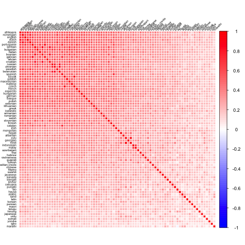
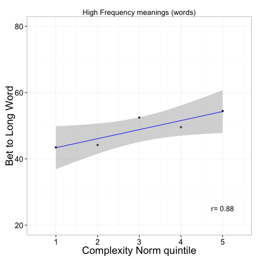
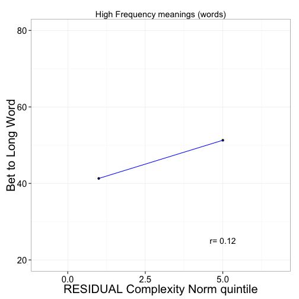
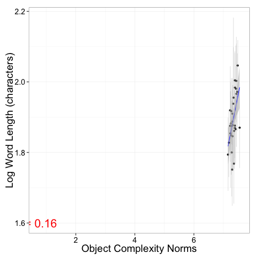

Referential Complexity Analyses
====
M. Lewis 
====
September 03, 2014
====

***
***

<h2> Analyses:<h2>

1. [Geons](#geons) <br/> 
  (A) [Norms](#1a) <br/> 
  (B) [Mappping task](#1b)<br/>
  
2. [Novel real objects](#novelRealObjs)<br/> 
  (A) [Norms](#2a)<br/> 
  (B) [Mappping task (adults)](#2b) <br/> 
  (\(C\)) [Production task (labels + descriptions)](#2c) <br/> 

3. [Natural language](#xling) <br/> 
  (A) [English norms](#3a) <br/>
  (B) [Xling translation accuracy](#3b) <br/> 
  (\(C\)) [Xling correlation between lengths and complexity](#3c) <br/> 
  
***
***

#### SET GLOBAL VARIABLES


#### LOAD PACKAGES, FUNCTIONS, AND REPEAT SUBJ DATA FILE


***
***

<a name="geons"/>

## (1) Geons

<a name="1a"/>

### (A) Norms [(Complexity Task)][task34] [(RT task)][task35]
### (1) Complexity Norms
### *get data into long form*

```r
if (processNorms) {
  # read in data
  d <- read.csv("data/RefComplex34.results",sep="\t",header=TRUE)
  
  # melt
  md <- melt(d,id.vars=c("workerid"),measure.vars=names(d)[grepl("obj",names(d))])
  md$trial <- matrix(lapply(str_split(md$variable,"_"),function(x) {x[2]}))
  md$obj <- unlist(matrix(lapply(str_split(md$value,"j"),function(x) {x[2]})))
  md$obj <- unlist(matrix(lapply(str_split(md$obj,".p"),function(x) {x[1]})))
  md$complexityLevel <- unlist(matrix(lapply(str_split(md$obj,"-"),function(x) {x[1]})))
  md$objID <- unlist(matrix(lapply(str_split(md$obj,"-"),function(x) {x[2]})))
  md$value <- NULL; md$variable <- NULL
  md = md[(md$trial != 0 & md$trial != 1),] # remove ball and circuit
  
  # get rating info
  mdr <- melt(d,id.vars=c("workerid"),measure.vars=names(d)[grepl("rating",names(d))])
  mdr$trial <- matrix(lapply(str_split(mdr$variable,"_"),function(x) {x[2]}))
  mdr$variable <- NULL
  
  # merge together based on trial and workerid
  m = merge(md,mdr,by=c("workerid","trial"))
  m$value <- as.numeric(as.character(m$value))
  
  # get norms by objects
  ms_all <- aggregate(value ~ obj, data=m, mean)
  ms_all$cih <- aggregate(value ~ obj, data=m, ci.high)$value
  ms_all$cil <- aggregate(value ~ obj, data=m, ci.low)$value
  
  names(ms_all)[2] = "meanRating"
  ms_all <- ms_all[order(ms_all$meanRating),]

  # save complexity by item
  write.csv(ms_all, "data/complicatedNormsGeons_BYITEM.csv")
  } 

cg_norms = read.csv("data/complicatedNormsGeons_BYITEM.csv")
```

### *plot complexity norm by condition*

```r
  # remove quotes from norms
  cg_norms$obj <- as.factor(as.numeric(gsub("[[:punct:]]", "", cg_norms$obj)))
  cg_norms$obj_class = as.numeric(substr(cg_norms$obj, 1, 1))
  cg_norms$obj_item = as.numeric(substr(cg_norms$obj, 2, 2))

  ms <- aggregate(meanRating  ~ obj_class, data=cg_norms, mean)
  ms$cih <- aggregate(meanRating  ~ obj_class, data=cg_norms, ci.high)$meanRating
  ms$cil <- aggregate(meanRating  ~ obj_class, data=cg_norms, ci.low)$meanRating
    
  # plot
  ggplot(ms, aes(y=meanRating, x=as.numeric(obj_class))) +
    geom_errorbar(data=ms, mapping=aes(x=obj_class, ymax = meanRating+cih, 
                                       ymin=meanRating-cil), width=0.2, size=1, color="black") + 
    geom_point(data=ms, mapping=aes(x=obj_class, y=meanRating), size=6)  +
    geom_line() +
    xlab("Object Condition") +
    ylab("Complexity rating") +
    ggtitle("complexity norm vs. number of geons")
```

 

### *get complexity norm and condition correlation*

```r
# make object class numeric
cg_norms$obj_class = as.numeric(cg_norms$obj_class) 

# correlation between num geons and complexity
cor.test(cg_norms$obj_class, cg_norms$meanRating)
```

```
## 
## 	Pearson's product-moment correlation
## 
## data:  cg_norms$obj_class and cg_norms$meanRating
## t = 15.39, df = 38, p-value < 2.2e-16
## alternative hypothesis: true correlation is not equal to 0
## 95 percent confidence interval:
##  0.8677 0.9617
## sample estimates:
##    cor 
## 0.9283
```


### (2) RT Norms 
### *get data into long form (accuracy and RT df) and do exclusions*

```r
if (processNorms) {
  # read in data
  raw <- read.csv("data/RefComplex37.results",sep="\t",header=TRUE)
  
  # remove repeat subjects?
  if (whichSubjRemove == 'removeRepeatSubj') {
    raw = merge(raw, dups, by=c("hitid","workerid"))
    raw = raw[!raw$repeatSubj,]
    } else if (whichSubjRemove == 'withinRepeatSubj') {
      raw = merge(raw, dups, by=c("hitid","workerid"))
      raw = raw[!raw$withinRepeatSubj,]
      }
  
  # look at accuracy, and exclude those below chance
  boxplot(raw$Answer.correct)
  raw = raw[raw$Answer.correct > 20, ]
  
  # prep accuracy and RT dataframes
  # accuracy data frame
  # melt
  n <- names(raw)
  cols = c( n[grepl("test",n)])
  mda <- melt(raw,id.vars=c("workerid"), measure.vars=cols,na.rm=TRUE)
  mda$trial <-as.numeric(matrix(lapply(str_split(mda$variable,"_"),function(x) {x[3]})))
  mda$var1 <- matrix(lapply(str_split(mda$variable,"_"),function(x) {x[1]}))
  mda$var2 <- matrix(lapply(str_split(mda$variable,"_"),function(x) {x[2]}))
  mda$var <- paste(mda$var1, mda$var2, sep = "_")
  mda$variable <- NULL; mda$var1 <- NULL; mda$var2 <- NULL
  
  mda$seq <- with(mda, ave(value, workerid, var, FUN = seq_along))
  da = dcast(workerid + seq + trial ~ var, data = mda, value.var = "value")
  da$seq <- NULL
  
  da=da[!is.na(da$trial),]
  
  da$Answer.test_answer = as.factor(da$Answer.test_answer)
  da$Answer.test_answerEval = as.factor(da$Answer.test_answerEval)
  da$Answer.test_image  = as.factor(da$Answer.test_image)
  
  # look at memory performance (correct: CR or hit)
  numCR = length(which(da$Answer.test_answerEval == "\"CR\""))
  numH = length(which(da$Answer.test_answerEval == "\"H\""))

  correct = (numCR + numH)/ dim(da)[1]
  print(paste("percent correct:" , round(correct)))

  # get obj condition variable
  da$test_image2 <- as.character(matrix(lapply(str_split(da$Answer.test_image,"j"), function(x) {x[2]})))
  da$objCondition <- as.factor(as.character(matrix(lapply(str_split(da$test_image2,"-"), function(x) {x[1]}))))
  da$objItem <- as.character(matrix(lapply(str_split(da$test_image2,"-"), function(x) {x[2]})))
  da$objItem<- as.factor(as.numeric(gsub("[[:punct:]]", "", da$objItem)))
  
  # RT dataframe
  # melt
  n <- names(raw)
  cols = c(n[grepl("train", n)])
  cols = cols[1:40]
  md <- melt(raw, id.vars=c("workerid"), measure.vars=cols)
  md$trial <- as.numeric(matrix(lapply(str_split(md$variable,"_"),function(x) {x[3]})))
  md$var1 <- matrix(lapply(str_split(md$variable,"_"),function(x) {x[1]}))
  md$var2 <- matrix(lapply(str_split(md$variable,"_"),function(x) {x[2]}))
  md$var <- paste(md$var1, md$var2, sep = "_")
  md$variable <- NULL; md$var1 <- NULL; md$var2 <- NULL
  
  md$seq <- with(md, ave(value, workerid, var, FUN = seq_along))
  d = dcast(workerid + seq + trial ~ var, data = md, value.var = "value")
  d$Answer.train_NA <- NULL; d$seq <- NULL
  
  d=d[!is.na(d$trial),]
  d=d[!is.na(d$Answer.train_image),]
  d=d[!is.na(d$Answer.train_rt),]
  d=d[d$Answer.train_image != "undefined",]
  d=d[d$Answer.train_image != "",]
  
  d$Answer.train_rt = as.numeric(d$Answer.train_rt)
  
  # exclude outlier 2 standard deviations above and below mean (in log space)
  d$log.rt = log(d$Answer.train_rt)
  total = dim(d)[1]
  sd2 = 2*sd(d$log.rt)
  d = d[(d$log.rt > (mean(d$log.rt) - sd2)) & (d$log.rt < (mean(d$log.rt) + sd2)),]
  print(paste("percent trimmed:" , round((total - dim(d)[1])/total,2)))
  hist(d$log.rt)
  
  # get obj condition
  d = d[d$trial > 1,] # exclude anchors (not interesting because order not randomized)
  d$train_image2 <- as.character(matrix(lapply(str_split(d$Answer.train_image,"j"), function(x) {x[2]})))
  d$objCondition <- as.factor(as.character(matrix(lapply(str_split(d$train_image2,"-"), function(x) {x[1]}))))
  d$objItem <- as.character(matrix(lapply(str_split(d$train_image2,"-"), function(x) {x[2]})))
  d$objItem<- as.factor(as.numeric(gsub("[[:punct:]]", "", d$objItem)))
  d$obj <- paste("\"", d$objCondition, "-" ,d$objItem,"\"", sep = "" )
  
  # rt by item
  ms_all <- aggregate(log.rt  ~ obj, data=d, mean)
  ms_all$cih <- aggregate(log.rt ~ obj, data=d, ci.high)$log.rt
  ms_all$cil <- aggregate(log.rt ~ obj, data=d, ci.low)$log.rt
  
  # save RT by item
  write.csv(ms_all, "data/rtNormsGeons_BYITEM.csv")
  } 

rg_norms = read.csv("data/rtNormsGeons_BYITEM.csv")
```

###  *plot RT by condition*

```r
  rg_norms$obj <- as.factor(as.numeric(gsub("[[:punct:]]", "", rg_norms$obj)))
  rg_norms$obj_class = substr(rg_norms$obj, 1, 1)
  rg_norms$obj_item = substr(rg_norms$obj, 2, 2)

  ms <- aggregate(log.rt  ~ obj_class, data=rg_norms, mean)
  ms$cih <- aggregate(log.rt  ~ obj_class, data=rg_norms, ci.high)$log.rt
  ms$cil <- aggregate(log.rt  ~ obj_class, data=rg_norms, ci.low)$log.rt
    
  # plot
  ggplot(ms, aes(y=log.rt, x=as.numeric(obj_class))) +
    geom_errorbar(data=ms, mapping=aes(x=obj_class, ymax = log.rt+cih, 
                                       ymin=log.rt-cil), width=0.2, size=1, color="black") + 
    geom_point(data=ms, mapping=aes(x=obj_class, y=log.rt), size=6)  +
    geom_line() +
    xlab("Object Condition") +
    ylab("Log RT (ms)") + 
    ggtitle("RT vs. number of geons")
```

 

### *get RT correlation with condition*

```r
# make object class numeric
rg_norms$obj_class = as.numeric(rg_norms$obj_class) 

# correlation between num geons and complexity
cor.test(rg_norms$obj_class, rg_norms$log.rt)
```

```
## 
## 	Pearson's product-moment correlation
## 
## data:  rg_norms$obj_class and rg_norms$log.rt
## t = 15.43, df = 38, p-value < 2.2e-16
## alternative hypothesis: true correlation is not equal to 0
## 95 percent confidence interval:
##  0.8683 0.9619
## sample estimates:
##    cor 
## 0.9286
```

### *get correlation between between complexity rating and RT*

```r
index <- match(cg_norms$obj, rg_norms$obj)
cg_norms$rt_meanRating <- rg_norms$log.rt[index]

cor.test(cg_norms$rt_meanRating, cg_norms$meanRating)
```

```
## 
## 	Pearson's product-moment correlation
## 
## data:  cg_norms$rt_meanRating and cg_norms$meanRating
## t = 12.14, df = 38, p-value = 1.199e-14
## alternative hypothesis: true correlation is not equal to 0
## 95 percent confidence interval:
##  0.8033 0.9416
## sample estimates:
##    cor 
## 0.8917
```

<a name="1b"/>

### (B) Mapping task [(Task)][task37] 
### *get data into long form*

```r
if (doSlow){
  # read in data
  d <- read.csv("data/RefComplex38.results",sep="\t",header=TRUE)
  
  # remove repeat subjects?
  if (whichSubjRemove == 'removeRepeatSubj') {
    d = merge(d, dups, by=c("hitid","workerid"))
    d = d[!d$repeatSubj,]
    } else if (whichSubjRemove == 'withinRepeatSubj') {
      d = merge(d, dups, by=c("hitid","workerid"))
      d = d[!d$withinRepeatSubj,]
      }
  
  # melt
  md <- melt(d,id.vars=c("workerid"),measure.vars=c(names(d)[c(grepl("_",names(d)))]))
  md$trial <- matrix(lapply(str_split(md$variable,"_"),function(x) {x[2]}))
  md$variable <- as.character(matrix(lapply(str_split(md$variable,"_"),function(x) {x[1]})))
  md$variable <- matrix(lapply(str_split(md$variable,"Answer."),function(x) {x[2]}))
  
  md$variable <- as.factor(as.character(md$variable))
  md$trial <- as.factor(as.character(md$trial))
  md$value <- as.factor(as.character(md$value))
  md$workerid <- as.factor(as.character(md$workerid))
  
  md$seq <- with(md, ave(value, workerid, variable, trial, FUN = seq_along))
  dc <- dcast(workerid + seq + trial ~ variable, data = md, value.var = "value")
  dc$seq <- NULL
  
  # make everything factors
  dc$criticalComplicated  <- as.factor(as.numeric(gsub("[[:punct:]]", "", dc$criticalComplicated))) #strip punctuations
  dc$criticalSimple  <- as.factor(as.numeric(gsub("[[:punct:]]", "", dc$criticalSimple))) #strip punctuations
  dc$langCondition <- as.factor(dc$langCondition)
  dc$objCondition <- as.factor(dc$objCondition)
  dc$response <- as.factor(dc$response)
  dc$responseSide <- as.factor(dc$responseSide)
  dc$responseValue  <- as.factor(dc$responseValue)
  dc$word <- as.factor(dc$word)
  
  # merge in norms
  # complicated
  index <- match(dc$criticalSimple, cg_norms$obj)
  dc$criticalSimple_c.norms <- cg_norms$meanRating[index]
  index <- match(dc$criticalComplicated,cg_norms$obj)
  dc$criticalComplicated_c.norms <- cg_norms$meanRating[index]
  
  # rt
  index <- match(dc$criticalSimple, rg_norms$obj)
  dc$criticalSimple_rt.norms <- rg_norms$log.rt [index]
  index <- match(dc$criticalComplicated, rg_norms$obj)
  dc$criticalComplicated_rt.norms <- rg_norms$log.rt [index]
  
  dc$c.ratio = dc$criticalSimple_c.norms/dc$criticalComplicated_c.norms
  dc$rt.ratio = dc$criticalSimple_rt.norms/dc$criticalComplicated_rt.norms
  
  write.csv(dc, "data/RC38_long.csv")
  }

dc <- read.csv('data/RC38_long.csv')
```

### *get effect sizes*

```r
de <- ddply(dc, .(objCondition), function (d) {d.fc(d)})
```

### *get obj conditions*

```r
de$cond1 <- as.factor(unlist(matrix(lapply(str_split(de$objCondition ,"-"),function(x) {x[1]}))))
de$cond2 <- as.factor(unlist(matrix(lapply(str_split(de$objCondition ,"-"),function(x) {x[2]}))))
de$cond1<- as.factor(gsub("[[:punct:]]", "", de$cond1))
de$cond2<- as.numeric(gsub("[[:punct:]]", "", de$cond2))
de$objCondition2 = paste(de$cond1, "/", de$cond2, sep = "")
```

### *plot complexity ratios as a function of condition*

```r
# set graphical params
fs = 25
rs = 8

# complexity ratio
geon_c_plot = ggplot(de, aes(y=effect_size, x=c.Mratio)) +
  geom_pointrange( aes(ymax = cill, ymin=ciul))+
  geom_hline(yintercept=0,lty=2) +
  stat_smooth(method="lm") +
  #geom_text(aes(c.Mratio + .05, effect_size, label=objCondition2)) +
  ylab("effect size (Cohen's d)") +
  xlab("complexity rating ratio") + 
  theme(text = element_text(size=fs))  +
  scale_y_continuous(limits = c(-.33, .66)) +
  scale_x_continuous(limits = c(.25, 1.29)) +
  annotate("text", x=1.15, y=.5, color = "red", size = rs,
           label=paste("r=",round(cor(de$effect_size, de$c.Mratio), 2))) +
  theme(plot.background = element_blank(),
  panel.grid.major = element_blank(),
  panel.grid.minor = element_blank()) 

# rt ratio
geon_rt_plot = ggplot(de, aes(y=effect_size, x=rt.Mratio)) +
  geom_pointrange( aes(ymax = cill, ymin=ciul))+
  geom_hline(yintercept=0,lty=2) +
  stat_smooth(method="lm") +
  #geom_text(aes(rt.Mratio + .0025, effect_size, label=objCondition2)) +
  ylab("effect size (Cohen's d)") +
  xlab("reaction time ratio") + 
  theme(text = element_text(size=fs)) +  
  scale_y_continuous(limits = c(-.33, .66)) +
  scale_x_continuous(limits = c(.949, 1.005)) +
  annotate("text", x=.997, y=.5, color = "red", size = rs,
           label=paste("r=",round(cor(de$effect_size, de$rt.Mratio), 2))) +
  theme(plot.background = element_blank(),
  panel.grid.major = element_blank(),
  panel.grid.minor = element_blank()) 

if (savePlots){ 
  pdf("figure/geon.pdf", height = 6, width = 12)
  multiplot(geon_c_plot, geon_rt_plot, cols = 2)
  dev.off()
}else {
  multiplot(geon_c_plot, cols = 1)
  multiplot(geon_rt_plot, cols = 1)
}
```

  

###  *correlations between norms and effect sizes*

```r
cor.test(de$rt.Mratio, de$effect_size)
```

```
## 
## 	Pearson's product-moment correlation
## 
## data:  de$rt.Mratio and de$effect_size
## t = -5.249, df = 13, p-value = 0.0001572
## alternative hypothesis: true correlation is not equal to 0
## 95 percent confidence interval:
##  -0.9397 -0.5400
## sample estimates:
##     cor 
## -0.8243
```

```r
cor.test(de$c.Mratio, de$effect_size)
```

```
## 
## 	Pearson's product-moment correlation
## 
## data:  de$c.Mratio and de$effect_size
## t = -6.219, df = 13, p-value = 3.121e-05
## alternative hypothesis: true correlation is not equal to 0
## 95 percent confidence interval:
##  -0.9544 -0.6337
## sample estimates:
##     cor 
## -0.8651
```

***
***

<a name="novelRealObjs"/>

## (2) Novel real objects

<a name="2a"/>

### (A) Norms [Complexity norming task][task30] [RT task][task9]

### (1) Complexity Norms
### *get data into long form, compute correlations between 2 samples, figure out quintiles, remove dupliate subjects*

```r
if (processNorms){
  ## Sample #1
  da <- read.csv("data/RefComplex9a.results",sep="\t",header=TRUE)
  da[,31:92] <- lapply(da[,31:92],as.character)
  da[,31:92] <- lapply(da[,31:92],as.numeric)
  
  # melt
  md <- melt(da,id.vars=c("workerid"),measure.vars=names(da)[grepl("rating",names(da))])
  names(md) <- c("workerid", "rating", "value")
  ms = aggregate(value ~ rating, md, mean)

  ## Sample #2
  db <- read.csv("data/RefComplex9b.results",sep="\t",header=TRUE)
  db[,30:92] <- lapply(db[,30:92],as.character)
  db[,30:92] <- lapply(db[,30:92],as.numeric)
  
  # melt
  mdb <- melt(db,id.vars=c("workerid"),measure.vars=names(db)[grepl("rating",names(db))])
  names(mdb) <- c("workerid", "rating", "value")
  msb = aggregate(value ~ rating, mdb, mean)
  
  # merge two samples together to get lists for experiments 
  all_ratings = rbind(md, mdb)
  all_ms = aggregate(value ~ rating, all_ratings, mean)
  all_ms$ratingNum <- matrix(sapply(str_split(matrix(sapply(str_split(all_ms$rating,"rating"),
                                                            function(x) {x[2]})),"_"),function(x){x[1]}))
  all_ms$ratingNum<- as.numeric(str_replace_all(as.character(all_ms$ratingNum),"\\\"",""))
  all_ms$cil = aggregate(value ~ rating, all_ratings, ci.low)$value
  all_ms$cih = aggregate(value ~ rating, all_ratings, ci.high)$value
  
  all_ms = all_ms[!is.na(all_ms$ratingNum),] # get rid of ball and motherboard
  
  # add back in ratings for each samples
  all_ms = merge(all_ms, ms, by="rating")
  all_ms = merge(all_ms, msb, by="rating")
  
  all_ms$rating <- NULL
  names(all_ms) = c("meanRating" , "ratingNum", "cil", "cih" ,"rating_1","rating_2" )
  all_ms <- all_ms[c(2,1,3:6)]
  
  # get quintiles
  q = quantile(all_ms$meanRating, seq(0,1, by=.2))
  one = all_ms[which(all_ms$meanRating<q[2]), "ratingNum"]
  two = all_ms[which(all_ms$meanRating>q[2] & all_ms$meanRating<q[3]), "ratingNum"]
  three = all_ms[which(all_ms$meanRating>q[3] & all_ms$meanRating<q[4]), "ratingNum"]
  four = all_ms[which(all_ms$meanRating>q[4] & all_ms$meanRating<q[5]), "ratingNum"]
  five = all_ms[which(all_ms$meanRating>q[5]), "ratingNum"]
  
  one # 13 15 19 20 28 29  3 44 46 54 57 59
  two # 10 17  2 22 34 37  4 49  5 55  6  9
  three # 12 50 7 8 48 16 1 39 40 56 24 60
  four # 26 18 11 47 42 30 23 31 51 58 41 45
  five # 14 21 25 27 32 33 35 36 38 43 52 53
  
  all_ms$quintile = ifelse(is.element(all_ms$ratingNum, one), 1, 
                           ifelse(is.element(all_ms$ratingNum, two), 2,
                                  ifelse(is.element(all_ms$ratingNum, three), 3,
                                         ifelse(is.element(all_ms$ratingNum, four), 4,
                                                ifelse(is.element(all_ms$ratingNum, five), 5,
                                                       "error")))))
  all_ms$quintile = as.numeric(all_ms$quintile)
  all_ms <- all_ms[order(all_ms$meanRating),]
  
  # there is one participant who was in both samples. Look at correlation between samples without this participant in Sample #2 
  # Sample #2 
  # melt
  mdb <- melt(db[db$workerid != 'A1BQEX75BE1AYE',],id.vars=c("workerid"),measure.vars=names(db)[grepl("rating",names(db))])
  names(mdb) <- c("workerid", "rating", "value")
  msb = aggregate(value ~ rating, mdb, mean)
  
  co_norms_unique_sample = merge(ms, msb, by="rating")
  co_norms_unique_sample$ratingNum <- as.numeric(matrix(sapply(str_split(matrix(sapply(str_split(co_norms_unique_sample$rating,"rating")
                                                                                       ,function(x) {x[2]})),"_"),function(x){x[1]})))
  co_norms_unique_sample = co_norms_unique_sample[!is.na(co_norms_unique_sample$ratingNum),] # get rid of ball and motherboard

  co_norms_unique_sample$rating <- NULL
  names(co_norms_unique_sample) = c( "rating_1", "rating_2", "ratingNum")
  print('reliability, removing duplicate subj:',round(cor(co_norms_unique_sample$rating_1, co_norms_unique_sample$rating_2),2)) # nearly identical to original sample
  
  # write to csv (use write.table to can exclude headers, so matlab can read for figure)
  write.table(all_ms, file="data/complicatedNormsObjs_BYITEM-m.csv", 
            row.names=FALSE, col.names=FALSE, sep=",")
  
  # write to csv
  write.csv(all_ms, "data/complicatedNormsObjs_BYITEM.csv")
  }

co_norms = read.csv("data/complicatedNormsObjs_BYITEM.csv")
```

### *get reliability between two samples*

```r
cor.test(co_norms$rating_1, co_norms$rating_2)
```

```
## 
## 	Pearson's product-moment correlation
## 
## data:  co_norms$rating_1 and co_norms$rating_2
## t = 18.91, df = 58, p-value < 2.2e-16
## alternative hypothesis: true correlation is not equal to 0
## 95 percent confidence interval:
##  0.8812 0.9563
## sample estimates:
##    cor 
## 0.9276
```

### (2) RT Norms
### *get data into long form (accuracy and RT df) and do exclusions*

```r
if (processNorms){
  raw <- read.csv("data/RefComplex30.results",sep="\t",header=TRUE)
  
  if (whichSubjRemove == 'repeatSubj') {
    raw = merge(raw, dups, by=c("hitid","workerid"))
    raw = raw[!raw$repeatSubj,]
    } else if (whichSubjRemove == 'withinRepeatSubj') {
      raw = merge(raw, dups, by=c("hitid","workerid"))
      raw = raw[!raw$withinRepeatSubj,]
      }
    
  # look at accuracy, and exclude those below chance
  boxplot(raw$Answer.correct)
  raw = raw[raw$Answer.correct > 30, ]
  
  # accuracy dataframe
  n <- names(raw)
  cols = c( n[grepl("test",n)])
  mda <- melt(raw,id.vars=c("workerid"), measure.vars=cols,na.rm=TRUE)
  mda$trial <-as.numeric(matrix(lapply(str_split(mda$variable,"_"),function(x) {x[3]})))
  mda$var1 <- matrix(lapply(str_split(mda$variable,"_"),function(x) {x[1]}))
  mda$var2 <- matrix(lapply(str_split(mda$variable,"_"),function(x) {x[2]}))
  mda$var <- paste(mda$var1, mda$var2, sep = "_")
  mda$variable <- NULL; mda$var1 <- NULL; mda$var2 <- NULL
  
  mda$seq <- with(mda, ave(value, workerid, var, FUN = seq_along))
  da = dcast(workerid + seq + trial ~ var, data = mda, value.var = "value")
  da$seq <- NULL
  
  da=da[!is.na(da$trial),]
  
  da$Answer.test_answer = as.factor(da$Answer.test_answer)
  da$Answer.test_answerEval = as.factor(da$Answer.test_answerEval)
  da$Answer.test_image  = as.factor(da$Answer.test_image)
  
  # look at memory performance (correct: CR or hit)
  numCR = length(which(da$Answer.test_answerEval == "\"CR\""))
  numH = length(which(da$Answer.test_answerEval == "\"H\""))

  correct = (numCR + numH)/ dim(da)[1]
  print(paste("percent correct:" , round(correct)))
  
  # RT dataframe
  n <- names(raw)
  cols = c(  n[grepl("train",n)], n["correct"])
  cols = cols[1:154]
  md <- melt(raw,id.vars=c("workerid"), measure.vars=cols,na.rm=TRUE)
  md$trial <-as.numeric(matrix(lapply(str_split(md$variable,"_"),function(x) {x[3]})))
  md$var1 <- matrix(lapply(str_split(md$variable,"_"),function(x) {x[1]}))
  md$var2 <- matrix(lapply(str_split(md$variable,"_"),function(x) {x[2]}))
  md$var <- paste(md$var1, md$var2, sep = "_")
  md$variable <- NULL; md$var1 <- NULL; md$var2 <- NULL
  
  md$seq <- with(md, ave(value, workerid, var, FUN = seq_along))
  d = dcast(workerid + seq + trial ~ var, data = md, value.var = "value")
  d$Answer.train_NA <- NULL; d$seq <- NULL
  
  d=d[!is.na(d$trial),]
  d=d[!is.na(d$Answer.train_image),]
  d=d[!is.na(d$Answer.train_rt),]
  d=d[d$Answer.train_image != "undefined",]
  d=d[d$Answer.train_image != "",]
  
  d$Answer.train_image = as.factor(d$Answer.train_image)
  d$Answer.train_rt = as.numeric(d$Answer.train_rt)
  
  #exclude outlier 2 standard deviations above and below mean (in log space)
  d$log.rt = log(d$Answer.train_rt)
  total = dim(d)[1]
  sd2 = 2*sd(d$log.rt)
  d = d[(d$log.rt > (mean(d$log.rt) - sd2)) & (d$log.rt < (mean(d$log.rt) + sd2)),]
  print(paste("percent trimmed:" , round((total - dim(d)[1])/total,2)))
  hist(d$log.rt)
  
  # aggregate
  ms <- aggregate(log.rt  ~ Answer.train_image, data=d, mean)
  ms$rt_cil <- aggregate(log.rt ~ Answer.train_image, data=d, ci.low)$log.rt 
  ms$rt_cih <- aggregate(log.rt ~ Answer.train_image, data=d, ci.high)$log.rt 
  
  ms = ms[ms$Answer.train_image != 61,] # get rid of ball and motherboard
  ms = ms[ms$Answer.train_image != 62,] 

  write.csv(ms,"data/rtNormsObjs_BYITEM.csv")
  }

rto_norms = read.csv("data/rtNormsObjs_BYITEM.csv")
```

### *correlation between norms*

```r
index <- match(co_norms$ratingNum, rto_norms$Answer.train_image)
co_norms$log.rt <- rto_norms$log.rt[index]
cor.test(co_norms$meanRating, co_norms$log.rt)
```

```
## 
## 	Pearson's product-moment correlation
## 
## data:  co_norms$meanRating and co_norms$log.rt
## t = 4.865, df = 58, p-value = 9.152e-06
## alternative hypothesis: true correlation is not equal to 0
## 95 percent confidence interval:
##  0.3294 0.6970
## sample estimates:
##    cor 
## 0.5383
```

<a name="2b"/>

### (B) Mapping task (adults) [(Task)][task34]

### *get data into long form*

```r
if (doSlow) {
  d <- read.csv("data/RefComplex35.results",sep="\t",header=TRUE)
  
  if (whichSubjRemove == 'removeRepeatSubj') {
    d = merge(d, dups, by=c("hitid","workerid"))
    d = d[!d$repeatSubj,]
    } else if (whichSubjRemove == 'withinRepeatSubj') {
      d = merge(d, dups, by=c("hitid","workerid"))
      d = d[!d$withinRepeatSubj,]
      }
  
  # get in long form
  # get trial info
  md <- melt(d,id.vars=c("workerid"),
             measure.vars=c(names(d)[c(grepl("_",names(d)))]))
  md$trial <- matrix(lapply(str_split(md$variable,"_"),function(x) {x[2]}))
  md$variable <- as.character(matrix(lapply(str_split(md$variable,"_"),function(x) {x[1]})))
  md$variable <- matrix(lapply(str_split(md$variable,"Answer."),function(x) {x[2]}))
  
  md$variable <- as.factor(as.character(md$variable))
  md$trial <- as.factor(as.character(md$trial))
  md$value <- as.factor(as.character(md$value))
  md$workerid <- as.factor(as.character(md$workerid))
  
  md$seq <- with(md, ave(value, workerid,  variable, trial, FUN = seq_along))
  dc = dcast(workerid + seq + trial ~ variable, data = md, value.var = "value")
  dc$seq <- NULL
  
  write.csv(dc, "data/RC35_long.csv")
  }

dc <-  read.csv("data/RC35_long.csv")
```

### *make everything factors*

```r
dc$criticalComplicated= gsub(" ", "", gsub("[[:punct:]]", "", dc$criticalComplicated))
dc$criticalSimple= gsub(" ", "", gsub("[[:punct:]]", "", dc$criticalSimple))

dc$criticalComplicated <- as.factor(dc$criticalComplicated)
dc$criticalSimple <- as.factor(dc$criticalSimple)
dc$langCondition <- as.factor(dc$langCondition)
dc$objCondition <- as.factor(dc$objCondition)
dc$response <- as.factor(dc$response)
dc$responseSide <- as.factor(dc$responseSide)
dc$responseValue<- as.factor(dc$responseValue)
dc$word <- as.factor(dc$word)
dc$trial <- as.numeric(dc$trial)
```

### *merge in norms*

```r
index <- match(dc$criticalSimple, co_norms$ratingNum)
dc$criticalSimple_c.norms <- co_norms$meanRating[index]
index <- match(dc$criticalComplicated, co_norms$ratingNum)
dc$criticalComplicated_c.norms <- co_norms$meanRating[index]

index <- match(dc$criticalSimple, rto_norms$Answer.train_image)
dc$criticalSimple_rt.norms <- rto_norms$log.rt [index]
index <- match(dc$criticalComplicated, rto_norms$Answer.train_image)
dc$criticalComplicated_rt.norms <- rto_norms$log.rt [index]

dc$c.ratio = dc$criticalSimple_c.norms/dc$criticalComplicated_c.norms
dc$rt.ratio = dc$criticalSimple_rt.norms/dc$criticalComplicated_rt.norms
```

### *get effect sizes*

```r
de <- ddply(dc, .(objCondition), function (d) {d.fc(d)})
```

### *get obj conditions*

```r
de$cond1 <- as.factor(unlist(matrix(lapply(str_split(de$objCondition ,"-"),function(x) {x[1]}))))
de$cond2 <- as.factor(unlist(matrix(lapply(str_split(de$objCondition ,"-"),function(x) {x[2]}))))
de$cond1<- as.factor(gsub("[[:punct:]]", "", de$cond1))
de$cond2<- as.factor(gsub("[[:punct:]]", "", de$cond2))
de$objRatio = as.numeric(de$cond1)/as.numeric(de$cond2)
de$l.objRatio <- log(de$objRatio)

de$objCondition2 = paste(de$cond1, "/", de$cond2, sep = "")
```

### *plot complexity ratios vs. condition*

```r
# set graphical params
fs = 25
rs = 8

# complexity plot
obj_c_plot = ggplot(de, aes(y=effect_size, x=c.Mratio)) +
  geom_pointrange(aes(ymax = cill, ymin=ciul),position="dodge")+
  geom_hline(yintercept=0,lty=2) +
  stat_smooth(method="lm") +
  #geom_text(aes(c.Mratio+.03, effect_size, label=objCondition2), position="dodge") +
  #geom_text(aes(c.Mratio+.04, effect_size, label=objCondition2), position="dodge") +
  ylab("effect size (Cohen's d)") +
  xlab("complexity rating ratio") + 
  #ggtitle("complexity ratio vs. effect size") +
  scale_x_continuous(limits = c(.25, 1.29)) +
  theme(text = element_text(size=fs), plot.title = element_text(size=20)) +
  annotate("text", x=1.15, y=.5, col = "red",label=paste(
    "r=",round(cor(de$effect_size, de$c.Mratio, use = "complete"), 2)), size = rs) +
  theme(plot.background = element_blank(),
  panel.grid.major = element_blank(),
  panel.grid.minor = element_blank()) +
  scale_y_continuous(limits = c(-.33, .66))

# RT ratio plot
obj_rt_plot = ggplot(de, aes(y=effect_size, x=rt.Mratio)) +
  geom_pointrange( aes(ymax = cill, ymin=ciul))+
  geom_hline(yintercept=0,lty=2) +
  stat_smooth(method="lm") +
  #geom_text(aes(rt.Mratio+.0008, effect_size, label=objCondition2)) +
  #geom_text(aes(rt.Mratio+.002, effect_size, label=objCondition2)) +
  ylab("effect size (Cohen's d)") +
  xlab("reaction time ratio") +
  scale_x_continuous(limits = c(.949, 1.005)) +
  #ggtitle("RT ratio vs. effect size") +
  theme(text = element_text(size=fs), plot.title = element_text(size=20)) +
  annotate("text", x=.997, y=.5, col = "red",label=paste("r=",round(cor(de$effect_size, de$rt.Mratio, use = "complete"), 2)), size = rs) +  
  theme(plot.background = element_blank(),
  panel.grid.major = element_blank(),
  panel.grid.minor = element_blank()) +
  scale_y_continuous(limits = c(-.33, .66))

if (savePlots) {
  pdf("figure/realobjs.pdf", height = 6, width = 12)
  multiplot(obj_c_plot, obj_rt_plot, cols = 2)
  dev.off()
} else {
  multiplot(obj_c_plot, cols = 1)
  multiplot(obj_rt_plot, cols = 1)
}
```

  

### *correlations between effect size and complexity conditions*

```r
cor.test(de$objRatio, de$effect_size)
```

```
## 
## 	Pearson's product-moment correlation
## 
## data:  de$objRatio and de$effect_size
## t = -3.051, df = 13, p-value = 0.009273
## alternative hypothesis: true correlation is not equal to 0
## 95 percent confidence interval:
##  -0.8703 -0.1999
## sample estimates:
##    cor 
## -0.646
```

```r
cor.test(de$c.Mratio, de$effect_size)
```

```
## 
## 	Pearson's product-moment correlation
## 
## data:  de$c.Mratio and de$effect_size
## t = -3.494, df = 13, p-value = 0.00396
## alternative hypothesis: true correlation is not equal to 0
## 95 percent confidence interval:
##  -0.8907 -0.2854
## sample estimates:
##     cor 
## -0.6959
```

```r
cor.test(de$rt.Mratio, de$effect_size)
```

```
## 
## 	Pearson's product-moment correlation
## 
## data:  de$rt.Mratio and de$effect_size
## t = -3.659, df = 13, p-value = 0.002887
## alternative hypothesis: true correlation is not equal to 0
## 95 percent confidence interval:
##  -0.8972 -0.3149
## sample estimates:
##     cor 
## -0.7123
```

<a name="2c"/>

### (\(C\)) Production task (labels + descriptions) 
### (1) Labels [(Task)][task27]
### *get data into long form*

```r
d <- read.csv("data/RefComplex27.results",sep="\t",header=TRUE)

if (whichSubjRemove == 'repeatSubj') {
    d = merge(d, dups, by=c("hitid","workerid"))
    d = d[!d$repeatSubj,]
    } else if (whichSubjRemove == 'withinRepeatSubj') {
      d = merge(d, dups, by=c("hitid","workerid"))
      d = d[!d$withinRepeatSubj,]
      }
  
n <- names(d)
d$Answer.pic_1 = as.factor(as.character(d$Answer.pic_1))
d$Answer.pic_2 = as.factor(as.character(d$Answer.pic_2))
d$Answer.pic_3 = as.factor(as.character(d$Answer.pic_3))
d$Answer.pic_4 = as.factor(as.character(d$Answer.pic_4))
d$Answer.pic_5 = as.factor(as.character(d$Answer.pic_5))
d$Answer.pic_6 = as.factor(as.character(d$Answer.pic_6))
d$Answer.pic_7 = as.factor(as.character(d$Answer.pic_7))
d$Answer.pic_8 = as.factor(as.character(d$Answer.pic_8))
d$Answer.pic_9 = as.factor(as.character(d$Answer.pic_9))
d$Answer.pic_10 = as.factor(as.character(d$Answer.pic_10))

cols = c( n[grepl("cond",n)], n[grepl("pic",n)], n[grepl("descLength",n)] )
md1 <- melt(d,id.vars=c("workerid"), measure.vars=cols,na.rm=TRUE)
md1$trial <-as.numeric(matrix(lapply(str_split(md1$variable,"_"),function(x) {x[2]})))

md1 <- melt(d,id.vars=c("workerid"), measure.vars=n[grepl("pic",n)],na.rm=TRUE)
md1$trial <-as.numeric(matrix(lapply(str_split(md1$variable,"_"),function(x) {x[2]})))
names(md1)[3]= "picture"
md1 = md1[,-2]

md2 <- melt(d,id.vars=c("workerid"), measure.vars=n[grepl("desc_",n)],na.rm=TRUE)
md2$trial <-as.numeric(matrix(lapply(str_split(md2$variable,"_"),function(x) {x[2]})))
names(md2)[3]= "description"
md2 = md2[,-2]

md3 <- melt(d,id.vars=c("workerid"), measure.vars=n[grepl("descLength",n)],na.rm=TRUE)
md3$trial <-as.numeric(matrix(lapply(str_split(md3$variable,"_"),function(x) {x[2]})))
names(md3)[3] = "length"
md3 = md3[,-2]

md4 <- melt(d,id.vars=c("workerid"), measure.vars=n[grepl("cond",n)],na.rm=TRUE)
md4$trial <-as.numeric(matrix(lapply(str_split(md4$variable,"_"),function(x) {x[2]})))
names(md4)[3] = "condition"
md4 = md4[,-2]

md12<- join(md1, md2,type = "inner")
md123<- join(md12, md3,type = "inner")
md<- join(md123, md4,type = "inner")

# add columns
md$numWords = sapply(gregexpr("\\W+", md$description), length) - 1
md$log.length <- log(md$length) 
md$log.trial <- log(md$trial)
md <- md[md$numWords == 1,]  #remove multi word responses
```

### *relationship between condition and label length*

```r
t.test(md[md$condition == '"complex"',"log.length"],md[md$condition == '"simple"',"log.length"],paired = TRUE)
```

```
## 
## 	Paired t-test
## 
## data:  md[md$condition == "\"complex\"", "log.length"] and md[md$condition == "\"simple\"", "log.length"]
## t = 3.735, df = 286, p-value = 0.0002269
## alternative hypothesis: true difference in means is not equal to 0
## 95 percent confidence interval:
##  0.03846 0.12417
## sample estimates:
## mean of the differences 
##                 0.08131
```

```r
summary(lmer(log.length~condition + (1+trial|workerid), md))
```

```
## Linear mixed model fit by REML ['lmerMod']
## Formula: log.length ~ condition + (1 + trial | workerid)
##    Data: md
## 
## REML criterion at convergence: -0.4
## 
## Scaled residuals: 
##    Min     1Q Median     3Q    Max 
## -4.009 -0.626  0.061  0.633  2.773 
## 
## Random effects:
##  Groups   Name        Variance Std.Dev. Corr
##  workerid (Intercept) 1.53e-02 0.12358      
##           trial       3.40e-06 0.00184  1.00
##  Residual             4.92e-02 0.22189      
## Number of obs: 574, groups:  workerid, 59
## 
## Fixed effects:
##                   Estimate Std. Error t value
## (Intercept)         1.9350     0.0218    88.7
## condition"simple"  -0.0797     0.0185    -4.3
## 
## Correlation of Fixed Effects:
##             (Intr)
## cndtn"smpl" -0.427
```

### *relationship between complicated norms and label length*

```r
index <- match(md$picture, co_norms$ratingNum)
md$c.norms <- co_norms$meanRating[index]

ms <- aggregate(log.length ~ c.norms + picture, data=md, mean)
ms$cih <- aggregate(log.length ~ c.norms + picture, data=md, ci.high)$log.length
ms$cil <- aggregate(log.length ~ c.norms + picture, data=md, ci.low)$log.length

#plot
ggplot(ms, aes(c.norms,log.length)) +
  geom_point() + 
  geom_smooth(method = "lm", color="blue", formula = y ~ x) +
  geom_errorbar(aes(ymax=log.length+cih,ymin=log.length-cil), size=0.2, colour="grey") +
  theme_bw() +
  xlab("Object Complexity Norms") +
  ylab("Log Word Length (characters)") +
  theme(axis.title=element_text(size=20), axis.text=element_text(size=15)) +
  annotate("text", x=.75, y=1.6, color = "red", size = 8,
    label=paste("r=",round(cor(md$log.length,md$c.norms), 2))) +
    ggtitle('Label length vs. complicated norms')
```

 

### *relationship between RT norms and label length*

```r
index <- match(md$picture, rto_norms$Answer.train_image)
md$rt.norms <- rto_norms$log.rt[index]

ms <- aggregate(log.length ~ rt.norms + picture, data=md, mean)
ms$cih <- aggregate(log.length ~ rt.norms + picture, data=md, ci.high)$log.length
ms$cil <- aggregate(log.length ~ rt.norms + picture, data=md, ci.low)$log.length

#plot
ggplot(ms, aes(rt.norms,log.length)) +
  geom_point() + 
  geom_smooth(method = "lm", color="blue", formula = y ~ x) +
  geom_errorbar(aes(ymax=log.length+cih,ymin=log.length-cil), size=0.2, colour="grey") +
  theme_bw() +
  xlab("Object RT Norms") +
  ylab("Log Word Length (characters)") +
  theme(axis.title=element_text(size=20), axis.text=element_text(size=15))+
  annotate("text", x=7.5, y=1.6, color = "red", size = 8,
    label=paste("r=",round(cor(md$log.length,md$rt.norms), 2)))+
    ggtitle('Label length vs. RT norms')
```

 

### (2) Descriptions [(Task)][task25]

### *get data in long form*

```r
d <- read.csv("data/RefComplex25.results",sep="\t",header=TRUE)

if (whichSubjRemove == 'repeatSubj') {
    d = merge(d, dups, by=c("hitid","workerid"))
    d = d[!d$repeatSubj,]
    } else if (whichSubjRemove == 'withinRepeatSubj') {
      d = merge(d, dups, by=c("hitid","workerid"))
      d = d[!d$withinRepeatSubj,]
      }
  
n <- names(d)
d$Answer.pic_1 = as.factor(as.character(d$Answer.pic_1))
d$Answer.pic_2 = as.factor(as.character(d$Answer.pic_2))
d$Answer.pic_3 = as.factor(as.character(d$Answer.pic_3))
d$Answer.pic_4 = as.factor(as.character(d$Answer.pic_4))
d$Answer.pic_5 = as.factor(as.character(d$Answer.pic_5))
d$Answer.pic_6 = as.factor(as.character(d$Answer.pic_6))
d$Answer.pic_7 = as.factor(as.character(d$Answer.pic_7))
d$Answer.pic_8 = as.factor(as.character(d$Answer.pic_8))
d$Answer.pic_9 = as.factor(as.character(d$Answer.pic_9))
d$Answer.pic_10 = as.factor(as.character(d$Answer.pic_10))

cols = c( n[grepl("cond",n)], n[grepl("pic",n)], n[grepl("descLength",n)] )
md1 <- melt(d,id.vars=c("workerid"), measure.vars=cols,na.rm=TRUE)
md1$trial <-as.numeric(matrix(lapply(str_split(md1$variable,"_"),function(x) {x[2]})))

md1 <- melt(d,id.vars=c("workerid"), measure.vars=n[grepl("pic",n)],na.rm=TRUE)
md1$trial <-as.numeric(matrix(lapply(str_split(md1$variable,"_"),function(x) {x[2]})))
names(md1)[3]= "picture"
md1 = md1[,-2]

md2 <- melt(d,id.vars=c("workerid"), measure.vars=n[grepl("desc_",n)],na.rm=TRUE)
md2$trial <-as.numeric(matrix(lapply(str_split(md2$variable,"_"),function(x) {x[2]})))
names(md2)[3]= "description"
md2 = md2[,-2]

md3 <- melt(d,id.vars=c("workerid"), measure.vars=n[grepl("descLength",n)],na.rm=TRUE)
md3$trial <-as.numeric(matrix(lapply(str_split(md3$variable,"_"),function(x) {x[2]})))
names(md3)[3] = "length"
md3 = md3[,-2]

md4 <- melt(d,id.vars=c("workerid"), measure.vars=n[grepl("cond",n)],na.rm=TRUE)
md4$trial <-as.numeric(matrix(lapply(str_split(md4$variable,"_"),function(x) {x[2]})))
names(md4)[3] = "condition"
md4 = md4[,-2]

md12<- join(md1, md2,type = "inner")
```

```
## Joining by: workerid, trial
```

```r
md123<- join(md12, md3,type = "inner")
```

```
## Joining by: workerid, trial
```

```r
md<- join(md123, md4,type = "inner")
```

```
## Joining by: workerid, trial
```

```r
# add number of words count
md$numWords = sapply(gregexpr("\\W+", md$description), length) - 1
md$length_r <-nchar(as.character(md$description))

# add clean length var (remove punctuation and spaces)
md$description_clean= gsub(" ", "", gsub("[[:punct:]]", "", md$description))
md$length_c= nchar(as.character(md$description_clean))
md$log.length_c = log(md$length_c)
```

### *relationship between condition and description length*

```r
#summary(lmer(length_c~condition + (1|workerid), md))
#summary(lmer(length_c~condition + trial + (1+trial|workerid), md))

summary(lmer(log.length_c~md$condition + (1|workerid), md))
```

```
## Linear mixed model fit by REML ['lmerMod']
## Formula: log.length_c ~ md$condition + (1 | workerid)
##    Data: md
## 
## REML criterion at convergence: 863.1
## 
## Scaled residuals: 
##    Min     1Q Median     3Q    Max 
## -3.004 -0.616  0.071  0.599  4.269 
## 
## Random effects:
##  Groups   Name        Variance Std.Dev.
##  workerid (Intercept) 0.476    0.690   
##  Residual             0.175    0.418   
## Number of obs: 600, groups:  workerid, 60
## 
## Fixed effects:
##                      Estimate Std. Error t value
## (Intercept)            3.3545     0.0922    36.4
## md$condition"simple"  -0.1128     0.0342    -3.3
## 
## Correlation of Fixed Effects:
##             (Intr)
## md$cndtn"s" -0.185
```

```r
summary(lmer(log.length_c~condition + trial + (1+trial|workerid), md))
```

```
## Linear mixed model fit by REML ['lmerMod']
## Formula: log.length_c ~ condition + trial + (1 + trial | workerid)
##    Data: md
## 
## REML criterion at convergence: 823.1
## 
## Scaled residuals: 
##    Min     1Q Median     3Q    Max 
## -3.185 -0.559  0.071  0.594  3.841 
## 
## Random effects:
##  Groups   Name        Variance Std.Dev. Corr 
##  workerid (Intercept) 0.43168  0.6570        
##           trial       0.00177  0.0421   -0.02
##  Residual             0.14949  0.3866        
## Number of obs: 600, groups:  workerid, 60
## 
## Fixed effects:
##                   Estimate Std. Error t value
## (Intercept)        3.54229    0.09310    38.0
## condition"simple" -0.12772    0.03260    -3.9
## trial             -0.03278    0.00773    -4.2
## 
## Correlation of Fixed Effects:
##             (Intr) cndt""
## cndtn"smpl" -0.189       
## trial       -0.252  0.031
```

```r
## plot
ggplot(md, aes(x=log.length_c, fill=condition)) + 
  geom_density(alpha = 0.2)+
  ggtitle('description length as a function of condition')
```

 

### *relationship between complexity norms and description length*

```r
index <- match(md$picture, co_norms$ratingNum)
md$c.norms <- co_norms$meanRating[index]

summary(lmer(log.length_c~c.norms + (1+trial|workerid), md))
```

```
## Linear mixed model fit by REML ['lmerMod']
## Formula: log.length_c ~ c.norms + (1 + trial | workerid)
##    Data: md
## 
## REML criterion at convergence: 826.8
## 
## Scaled residuals: 
##    Min     1Q Median     3Q    Max 
## -3.272 -0.551  0.069  0.587  3.893 
## 
## Random effects:
##  Groups   Name        Variance Std.Dev. Corr 
##  workerid (Intercept) 0.44295  0.6655        
##           trial       0.00275  0.0524   -0.11
##  Residual             0.14874  0.3857        
## Number of obs: 600, groups:  workerid, 60
## 
## Fixed effects:
##             Estimate Std. Error t value
## (Intercept)   3.2392     0.0944    34.3
## c.norms       0.2921     0.0691     4.2
## 
## Correlation of Fixed Effects:
##         (Intr)
## c.norms -0.346
```

```r
summary(lmer(log.length_c~c.norms + trial + (1|workerid), md)) # complexity norms predict length
```

```
## Linear mixed model fit by REML ['lmerMod']
## Formula: log.length_c ~ c.norms + trial + (1 | workerid)
##    Data: md
## 
## REML criterion at convergence: 836
## 
## Scaled residuals: 
##    Min     1Q Median     3Q    Max 
## -3.062 -0.625  0.060  0.597  4.042 
## 
## Random effects:
##  Groups   Name        Variance Std.Dev.
##  workerid (Intercept) 0.477    0.690   
##  Residual             0.165    0.406   
## Number of obs: 600, groups:  workerid, 60
## 
## Fixed effects:
##             Estimate Std. Error t value
## (Intercept)  3.34180    0.10143    32.9
## c.norms      0.28220    0.07006     4.0
## trial       -0.03248    0.00577    -5.6
## 
## Correlation of Fixed Effects:
##         (Intr) c.nrms
## c.norms -0.322       
## trial   -0.304 -0.027
```

```r
cor.test(md$log.length_c,md$c.norms)
```

```
## 
## 	Pearson's product-moment correlation
## 
## data:  md$log.length_c and md$c.norms
## t = 1.965, df = 598, p-value = 0.04993
## alternative hypothesis: true correlation is not equal to 0
## 95 percent confidence interval:
##  3.457e-05 1.591e-01
## sample estimates:
##     cor 
## 0.08008
```

```r
ms <- aggregate(log.length_c ~ c.norms + picture, data=md, mean)
ms$cih <- aggregate(log.length_c ~ c.norms + picture, data=md, ci.high)$log.length_c
ms$cil <- aggregate(log.length_c ~ c.norms + picture, data=md, ci.low)$log.length_c

ggplot(ms, aes(c.norms,log.length_c)) +
  geom_point() + 
  geom_smooth(method = "lm", color="blue", formula = y ~ x) +
  geom_errorbar(aes(ymax=log.length_c+cih,ymin=log.length_c-cil), size=0.2, colour="grey") +
  theme_bw() +
  xlab("Object Complexity Norms") +
  ylab("Log Description Length (characters)") +
  theme(axis.title=element_text(size=20), axis.text=element_text(size=15))+ 
  ggtitle('Description length vs. complexity norms')
```

 

### *relationship between RT norms and description length*

```r
index <- match(md$picture, rto_norms$Answer.train_image)
md$rt.norms <- rto_norms$log.rt[index]

summary(lmer(log.length_c~rt.norms + (1+trial|workerid), md))
```

```
## Linear mixed model fit by REML ['lmerMod']
## Formula: log.length_c ~ rt.norms + (1 + trial | workerid)
##    Data: md
## 
## REML criterion at convergence: 825.6
## 
## Scaled residuals: 
##    Min     1Q Median     3Q    Max 
## -3.306 -0.589  0.083  0.590  3.705 
## 
## Random effects:
##  Groups   Name        Variance Std.Dev. Corr 
##  workerid (Intercept) 0.43683  0.6609        
##           trial       0.00277  0.0527   -0.08
##  Residual             0.14889  0.3859        
## Number of obs: 600, groups:  workerid, 60
## 
## Fixed effects:
##             Estimate Std. Error t value
## (Intercept)   -2.262      1.373   -1.65
## rt.norms       0.770      0.187    4.12
## 
## Correlation of Fixed Effects:
##          (Intr)
## rt.norms -0.998
```

```r
summary(lmer(log.length_c~rt.norms + trial + (1|workerid), md)) #rt norms predict length
```

```
## Linear mixed model fit by REML ['lmerMod']
## Formula: log.length_c ~ rt.norms + trial + (1 | workerid)
##    Data: md
## 
## REML criterion at convergence: 836.3
## 
## Scaled residuals: 
##    Min     1Q Median     3Q    Max 
## -3.119 -0.587  0.079  0.615  3.803 
## 
## Random effects:
##  Groups   Name        Variance Std.Dev.
##  workerid (Intercept) 0.481    0.693   
##  Residual             0.165    0.406   
## Number of obs: 600, groups:  workerid, 60
## 
## Fixed effects:
##             Estimate Std. Error t value
## (Intercept) -1.71467    1.39726   -1.23
## rt.norms     0.70745    0.19008    3.72
## trial       -0.03215    0.00578   -5.57
## 
## Correlation of Fixed Effects:
##          (Intr) rt.nrm
## rt.norms -0.998       
## trial    -0.009 -0.014
```

```r
cor.test(md$log.length_c,md$rt.norms)
```

```
## 
## 	Pearson's product-moment correlation
## 
## data:  md$log.length_c and md$rt.norms
## t = 0.848, df = 598, p-value = 0.3968
## alternative hypothesis: true correlation is not equal to 0
## 95 percent confidence interval:
##  -0.04551  0.11438
## sample estimates:
##     cor 
## 0.03466
```

```r
ms <- aggregate(log.length_c ~ rt.norms + picture, data=md, mean)
ms$cil <- aggregate(log.length_c ~ rt.norms + picture, data=md, ci.low)$log.length_c
ms$cih <- aggregate(log.length_c ~ rt.norms + picture, data=md, ci.high)$log.length_c

ggplot(ms, aes(rt.norms,log.length_c)) +
  geom_point() + 
  geom_smooth(method = "lm", color="blue", formula = y ~ x) +
  geom_errorbar(aes(ymax=log.length_c+cih,ymin=log.length_c-cil), size=0.2, colour="grey") +
  theme_bw() +
  xlab("Object RT Norms") +
  ylab("Log Description Length (characters)") +
  theme(axis.title=element_text(size=20), axis.text=element_text(size=15))+
  ggtitle('Description length vs. rt norms')
```

 

***
***

<a name="xling"/>

## (3) Natural language 

<a name="3a"/>

###  (A) English Norms [(Complexity norms task)][task26]

### *preprocess and merge in stuff*

```r
if (processNorms) {
  d1 <- read.csv("data/RefComplex26.results1",sep="\t",header=TRUE)
  d2 <- read.csv("data/RefComplex26.results",sep="\t",header=TRUE)
  d <- rbind(d1,d2)
  
  if (whichSubjRemove == 'repeatSubj') {
    d = merge(d, dups, by=c("hitid","workerid"))
    d = d[!d$repeatSubj,]
  }
  
  # take out people who missed check question
  d = d[d$Answer.value_18 == 7, ] 
  
  # melt into word and values into two data frames, then rejoin based on workerid+trial id
  # (tricky because variable is string and number)
  n <- names(d)
  colsV =  n[grepl("value",n)] 
  colsW =  n[grepl("word_",n)] 
  mdW <- melt(d,id.vars=c("workerid"), measure.vars=colsW,na.rm=TRUE)
  mdW$trial <- as.numeric(matrix(lapply(str_split(mdW$variable,"_"),function(x) {x[2]})))
  mdW$index <- paste(mdW$workerid, mdW$trial, sep="_")
  mdV <- melt(d,id.vars=c("workerid"), measure.vars=colsV,na.rm=TRUE)
  mdV$trial <- as.numeric(matrix(lapply(str_split(mdV$variable,"_"),function(x) {x[2]})))
  mdV$index <- paste(mdV$workerid, mdV$trial, sep="_")
  
  # merge together
  index <- match(mdW$index, mdV$index)
  mdW$complexity <- mdV$value[index]
 
  # delete variables
  mdW$index <- NULL; mdW$variable <- NULL; names(mdW)[2] <- "word"; md <- mdW
  
  # remove quotes from words
  md$word= gsub(" ", "", gsub("[[:punct:]]", "", md$word))
  md$word = as.factor(md$word)
  
  # remove non-words
  md = md[md$word != "ball",] # anchor
  md = md[md$word != "motherboard",] # anchor
  md = md[md$word != "43",] # take out check question
  md = md[md$word != "peso",] # take out bad word
  
  # add length in characters
  md$nchars = nchar(as.character(md$word))
  
  # merge in word info
  # -- add mrc data --
  mrc = read.csv("data/MRC_corpus.csv")
  mrc = mrc[mrc$mrc.syl != "NA",]
  index <- match(md$word, mrc$word)
  md$mrc.fam <- mrc$mrc.fam[index]
  md$mrc.conc <- mrc$mrc.conc[index]
  md$mrc.imag <- mrc$mrc.imag[index]
  md$mrc.syl <- mrc$mrc.syl[index]
 
  # -- add phonemes from MRC --
  mrc = mrc[mrc$mrc.wtype != " ",]
  index <- match(md$word, mrc$word)
  md$mrc.phon <- mrc$mrc.phon[index]

  # -- add class --
  class = read.csv("data/english_class_codes.csv")
  index <- match(md$word, class$ENGLISH)
  md$class <- class$class_MLL[index]
  
  # -- add morphemes --
  morph = read.csv("data/numMorph_celex2.csv")
  index <- match(md$word, morph$ENGLISH)
  md$clx.morph <- morph$clx.numMorph[index]
  
  # -- add frequency --
  freqs = read.table("data/SUBTLEXusDataBase.txt",header=TRUE)
  index <- match(md$word, freqs$Word)
  md$subt.log.freq <- freqs$Lg10WF[index]
  
  # -- add brysbaert concreteness --
  b <- read.csv("data/brysbaert_corpus.csv",header=TRUE)
  b <- b[b$Word != "",] # get rid of empty rows
  b <- b[b$Bigram == 0,]# get rid of two word lemmas
  index <- match(md$word, b$Word)
  md$b.conc <- b$Conc.M[index]
  
  write.csv(md, "data/englishComplexityNorms.csv")
 }

eng = read.csv("data/englishComplexityNorms.csv")
```

### *aggregate across words of the same length*

```r
ms2 <- aggregate(complexity ~ nchars, data=eng, mean)
ms2$cih <- aggregate(complexity ~ nchars,  data=eng, ci.high)$complexity
ms2$cil <- aggregate(complexity ~ nchars,  data=eng, ci.low)$complexity

ggplot(ms2, aes(complexity, nchars)) +
  geom_point() + 
  geom_smooth(method = "lm", color="blue", formula = y ~ x) +
  geom_errorbarh(aes(xmax=complexity+cih,xmin=complexity-cil), size=.15, colour="black") +
  annotate("text", x=2, y=10, size = 10, label=paste("r=",round(cor(eng$complexity, eng$nchars), 2)), col="red")+
  scale_y_continuous(limits = c(0, 15), breaks = 1:14, labels = 1:14) +
  scale_x_continuous(limits = c(0, 7), breaks = 1:7, labels = 1:7)  +
  theme(axis.title=element_text(size=20), axis.text=element_text(size=15)) +
  xlab('Complexity Rating') +
  ylab('Word Length (characters)') +
  ggtitle("Number of characters vs. complexity rating")
```

 

### *aggregate across participants*

```r
  # have to do this separately for each length variable because drops words for which there are NAs *for any of the length vars*
  ms.syl <- aggregate(complexity ~ word + mrc.syl, data=eng, mean)
  ms.phon <- aggregate(complexity ~ word + mrc.phon, data=eng, mean)
  ms.morph <- aggregate(complexity ~ word + clx.morph, data=eng, mean)
```

### *correlations*

```r
cor.test(ms.syl$complexity, ms.syl$mrc.syl)
```

```
## 
## 	Pearson's product-moment correlation
## 
## data:  ms.syl$complexity and ms.syl$mrc.syl
## t = 18, df = 497, p-value < 2.2e-16
## alternative hypothesis: true correlation is not equal to 0
## 95 percent confidence interval:
##  0.5719 0.6785
## sample estimates:
##    cor 
## 0.6281
```

```r
cor.test(ms.phon$complexity, ms.phon$mrc.phon)
```

```
## 
## 	Pearson's product-moment correlation
## 
## data:  ms.phon$complexity and ms.phon$mrc.phon
## t = 19.23, df = 468, p-value < 2.2e-16
## alternative hypothesis: true correlation is not equal to 0
## 95 percent confidence interval:
##  0.6106 0.7120
## sample estimates:
##    cor 
## 0.6644
```

```r
cor.test(ms.morph$complexity, ms.morph$clx.morph)
```

```
## 
## 	Pearson's product-moment correlation
## 
## data:  ms.morph$complexity and ms.morph$clx.morph
## t = 10.53, df = 486, p-value < 2.2e-16
## alternative hypothesis: true correlation is not equal to 0
## 95 percent confidence interval:
##  0.3559 0.5006
## sample estimates:
##   cor 
## 0.431
```

```r
# mono-morphemic
ms_mono.syl = aggregate(complexity ~ word + mrc.syl, data=eng[eng$clx.morph == 1,], mean)
ms_mono.phon = aggregate(complexity ~ word + mrc.phon, data=eng[eng$clx.morph == 1,], mean)

cor.test(ms_mono.syl$complexity, ms_mono.syl$mrc.syl)
```

```
## 
## 	Pearson's product-moment correlation
## 
## data:  ms_mono.syl$complexity and ms_mono.syl$mrc.syl
## t = 10.19, df = 385, p-value < 2.2e-16
## alternative hypothesis: true correlation is not equal to 0
## 95 percent confidence interval:
##  0.3785 0.5359
## sample estimates:
##    cor 
## 0.4608
```

```r
cor.test(ms_mono.phon$complexity, ms_mono.phon$mrc.phon)
```

```
## 
## 	Pearson's product-moment correlation
## 
## data:  ms_mono.phon$complexity and ms_mono.phon$mrc.phon
## t = 12.03, df = 364, p-value < 2.2e-16
## alternative hypothesis: true correlation is not equal to 0
## 95 percent confidence interval:
##  0.4557 0.6029
## sample estimates:
##    cor 
## 0.5333
```

```r
# open class
ms_open.syl = aggregate(complexity ~ word + mrc.syl, data=eng[eng$class != 0,], mean)
ms_open.phon = aggregate(complexity ~ word + mrc.phon, data=eng[eng$class != 0,], mean)
ms_open.morph = aggregate(complexity ~ word + clx.morph, data=eng[eng$class != 0,], mean)

cor.test(ms_open.syl$complexity, ms_open.syl$mrc.syl)
```

```
## 
## 	Pearson's product-moment correlation
## 
## data:  ms_open.syl$complexity and ms_open.syl$mrc.syl
## t = 16.91, df = 451, p-value < 2.2e-16
## alternative hypothesis: true correlation is not equal to 0
## 95 percent confidence interval:
##  0.5632 0.6763
## sample estimates:
##   cor 
## 0.623
```

```r
cor.test(ms_open.phon$complexity, ms_open.phon$mrc.phon)
```

```
## 
## 	Pearson's product-moment correlation
## 
## data:  ms_open.phon$complexity and ms_open.phon$mrc.phon
## t = 17.89, df = 426, p-value < 2.2e-16
## alternative hypothesis: true correlation is not equal to 0
## 95 percent confidence interval:
##  0.5972 0.7059
## sample estimates:
##    cor 
## 0.6549
```

```r
cor.test(ms_open.morph$complexity, ms_open.morph$clx.morph)
```

```
## 
## 	Pearson's product-moment correlation
## 
## data:  ms_open.morph$complexity and ms_open.morph$clx.morph
## t = 9.959, df = 445, p-value < 2.2e-16
## alternative hypothesis: true correlation is not equal to 0
## 95 percent confidence interval:
##  0.3480 0.4999
## sample estimates:
##    cor 
## 0.4269
```

### *relationship beween length and complexity, control for everything*

```r
# all
m_syl = lm(mrc.syl ~ complexity + mrc.fam + mrc.imag + b.conc + subt.log.freq, eng)
m_phon = lm(mrc.phon ~ complexity + mrc.fam + mrc.imag + b.conc + subt.log.freq, eng)
m_morph = lm(clx.morph ~ complexity + mrc.fam + mrc.imag + b.conc + subt.log.freq, eng)
summary(m_syl)
```

```
## 
## Call:
## lm(formula = mrc.syl ~ complexity + mrc.fam + mrc.imag + b.conc + 
##     subt.log.freq, data = eng)
## 
## Residuals:
##    Min     1Q Median     3Q    Max 
## -1.972 -0.529 -0.089  0.445  3.323 
## 
## Coefficients:
##                Estimate Std. Error t value Pr(>|t|)    
## (Intercept)    2.813777   0.088517   31.79  < 2e-16 ***
## complexity     0.095021   0.005179   18.35  < 2e-16 ***
## mrc.fam        0.001236   0.000211    5.86  4.9e-09 ***
## mrc.imag       0.000313   0.000162    1.93    0.053 .  
## b.conc        -0.245203   0.015355  -15.97  < 2e-16 ***
## subt.log.freq -0.457728   0.014508  -31.55  < 2e-16 ***
## ---
## Signif. codes:  0 '***' 0.001 '**' 0.01 '*' 0.05 '.' 0.1 ' ' 1
## 
## Residual standard error: 0.777 on 6984 degrees of freedom
##   (308 observations deleted due to missingness)
## Multiple R-squared:  0.324,	Adjusted R-squared:  0.323 
## F-statistic:  669 on 5 and 6984 DF,  p-value: <2e-16
```

```r
summary(m_phon)
```

```
## 
## Call:
## lm(formula = mrc.phon ~ complexity + mrc.fam + mrc.imag + b.conc + 
##     subt.log.freq, data = eng)
## 
## Residuals:
##    Min     1Q Median     3Q    Max 
## -4.891 -1.068 -0.144  0.936  7.562 
## 
## Coefficients:
##                Estimate Std. Error t value Pr(>|t|)    
## (Intercept)    7.718613   0.202310   38.15  < 2e-16 ***
## complexity     0.214601   0.011518   18.63  < 2e-16 ***
## mrc.fam        0.001639   0.000487    3.37  0.00077 ***
## mrc.imag       0.001027   0.000364    2.82  0.00486 ** 
## b.conc        -0.546185   0.034531  -15.82  < 2e-16 ***
## subt.log.freq -1.122311   0.032758  -34.26  < 2e-16 ***
## ---
## Signif. codes:  0 '***' 0.001 '**' 0.01 '*' 0.05 '.' 0.1 ' ' 1
## 
## Residual standard error: 1.67 on 6564 degrees of freedom
##   (728 observations deleted due to missingness)
## Multiple R-squared:  0.387,	Adjusted R-squared:  0.387 
## F-statistic:  830 on 5 and 6564 DF,  p-value: <2e-16
```

```r
summary(m_morph)
```

```
## 
## Call:
## lm(formula = clx.morph ~ complexity + mrc.fam + mrc.imag + b.conc + 
##     subt.log.freq, data = eng)
## 
## Residuals:
##    Min     1Q Median     3Q    Max 
## -0.864 -0.287 -0.113  0.150  2.407 
## 
## Coefficients:
##                Estimate Std. Error t value Pr(>|t|)    
## (Intercept)    1.70e+00   5.29e-02   32.14  < 2e-16 ***
## complexity     2.85e-02   3.11e-03    9.16  < 2e-16 ***
## mrc.fam        9.12e-04   1.26e-04    7.24  5.0e-13 ***
## mrc.imag       4.30e-04   9.69e-05    4.44  9.2e-06 ***
## b.conc        -1.56e-01   9.17e-03  -17.00  < 2e-16 ***
## subt.log.freq -2.32e-01   8.69e-03  -26.74  < 2e-16 ***
## ---
## Signif. codes:  0 '***' 0.001 '**' 0.01 '*' 0.05 '.' 0.1 ' ' 1
## 
## Residual standard error: 0.462 on 6862 degrees of freedom
##   (430 observations deleted due to missingness)
## Multiple R-squared:  0.223,	Adjusted R-squared:  0.222 
## F-statistic:  393 on 5 and 6862 DF,  p-value: <2e-16
```

```r
# mono-morphemic
m_syl_m = lm(mrc.syl ~ complexity + mrc.fam + mrc.imag + b.conc + subt.log.freq, eng[eng$clx.morph == 1,])
m_phon_m = lm(mrc.phon ~ complexity + mrc.fam + mrc.imag + b.conc + subt.log.freq, eng[eng$clx.morph == 1,])
summary(m_syl_m)
```

```
## 
## Call:
## lm(formula = mrc.syl ~ complexity + mrc.fam + mrc.imag + b.conc + 
##     subt.log.freq, data = eng[eng$clx.morph == 1, ])
## 
## Residuals:
##    Min     1Q Median     3Q    Max 
## -1.085 -0.424 -0.181  0.402  3.309 
## 
## Coefficients:
##                Estimate Std. Error t value Pr(>|t|)    
## (Intercept)    1.863115   0.079002   23.58  < 2e-16 ***
## complexity     0.049478   0.004587   10.79  < 2e-16 ***
## mrc.fam        0.000605   0.000197    3.06   0.0022 ** 
## mrc.imag       0.000656   0.000143    4.58  4.8e-06 ***
## b.conc        -0.142304   0.013733  -10.36  < 2e-16 ***
## subt.log.freq -0.232356   0.013718  -16.94  < 2e-16 ***
## ---
## Signif. codes:  0 '***' 0.001 '**' 0.01 '*' 0.05 '.' 0.1 ' ' 1
## 
## Residual standard error: 0.596 on 5366 degrees of freedom
##   (383 observations deleted due to missingness)
## Multiple R-squared:  0.15,	Adjusted R-squared:  0.15 
## F-statistic:  190 on 5 and 5366 DF,  p-value: <2e-16
```

```r
summary(m_phon_m)
```

```
## 
## Call:
## lm(formula = mrc.phon ~ complexity + mrc.fam + mrc.imag + b.conc + 
##     subt.log.freq, data = eng[eng$clx.morph == 1, ])
## 
## Residuals:
##    Min     1Q Median     3Q    Max 
## -3.743 -0.756 -0.138  0.608  6.299 
## 
## Coefficients:
##                Estimate Std. Error t value Pr(>|t|)    
## (Intercept)    5.756289   0.183786   31.32  < 2e-16 ***
## complexity     0.117192   0.010259   11.42  < 2e-16 ***
## mrc.fam        0.000909   0.000466    1.95    0.051 .  
## mrc.imag       0.001650   0.000322    5.13  3.1e-07 ***
## b.conc        -0.387371   0.030343  -12.77  < 2e-16 ***
## subt.log.freq -0.680914   0.031636  -21.52  < 2e-16 ***
## ---
## Signif. codes:  0 '***' 0.001 '**' 0.01 '*' 0.05 '.' 0.1 ' ' 1
## 
## Residual standard error: 1.29 on 5069 degrees of freedom
##   (680 observations deleted due to missingness)
## Multiple R-squared:  0.244,	Adjusted R-squared:  0.243 
## F-statistic:  327 on 5 and 5069 DF,  p-value: <2e-16
```

```r
# open class
m_syl_o = lm(mrc.syl ~ complexity + mrc.fam + mrc.imag + b.conc + subt.log.freq, eng[eng$class != 0,])
m_phon_o = lm(mrc.phon ~ complexity + mrc.fam + mrc.imag + b.conc + subt.log.freq, eng[eng$class != 0,])
m_morph_o = lm(clx.morph ~ complexity + mrc.fam + mrc.imag + b.conc + subt.log.freq, eng[eng$class != 0,])
summary(m_syl_o)
```

```
## 
## Call:
## lm(formula = mrc.syl ~ complexity + mrc.fam + mrc.imag + b.conc + 
##     subt.log.freq, data = eng[eng$class != 0, ])
## 
## Residuals:
##    Min     1Q Median     3Q    Max 
## -1.994 -0.557 -0.097  0.487  3.306 
## 
## Coefficients:
##                Estimate Std. Error t value Pr(>|t|)    
## (Intercept)    2.875059   0.094716   30.35  < 2e-16 ***
## complexity     0.097953   0.005576   17.57  < 2e-16 ***
## mrc.fam        0.001178   0.000223    5.29  1.3e-07 ***
## mrc.imag       0.000230   0.000179    1.29      0.2    
## b.conc        -0.249263   0.016172  -15.41  < 2e-16 ***
## subt.log.freq -0.450754   0.016446  -27.41  < 2e-16 ***
## ---
## Signif. codes:  0 '***' 0.001 '**' 0.01 '*' 0.05 '.' 0.1 ' ' 1
## 
## Residual standard error: 0.8 on 6404 degrees of freedom
##   (242 observations deleted due to missingness)
## Multiple R-squared:  0.304,	Adjusted R-squared:  0.303 
## F-statistic:  558 on 5 and 6404 DF,  p-value: <2e-16
```

```r
summary(m_phon_o)
```

```
## 
## Call:
## lm(formula = mrc.phon ~ complexity + mrc.fam + mrc.imag + b.conc + 
##     subt.log.freq, data = eng[eng$class != 0, ])
## 
## Residuals:
##    Min     1Q Median     3Q    Max 
## -4.971 -1.112 -0.165  0.974  7.486 
## 
## Coefficients:
##                Estimate Std. Error t value Pr(>|t|)    
## (Intercept)    7.870476   0.213747   36.82  < 2e-16 ***
## complexity     0.219959   0.012306   17.87  < 2e-16 ***
## mrc.fam        0.001742   0.000511    3.41  0.00065 ***
## mrc.imag       0.000323   0.000400    0.81  0.42000    
## b.conc        -0.536074   0.036215  -14.80  < 2e-16 ***
## subt.log.freq -1.085803   0.037015  -29.33  < 2e-16 ***
## ---
## Signif. codes:  0 '***' 0.001 '**' 0.01 '*' 0.05 '.' 0.1 ' ' 1
## 
## Residual standard error: 1.72 on 6044 degrees of freedom
##   (602 observations deleted due to missingness)
## Multiple R-squared:  0.352,	Adjusted R-squared:  0.352 
## F-statistic:  658 on 5 and 6044 DF,  p-value: <2e-16
```

```r
summary(m_morph_o)
```

```
## 
## Call:
## lm(formula = clx.morph ~ complexity + mrc.fam + mrc.imag + b.conc + 
##     subt.log.freq, data = eng[eng$class != 0, ])
## 
## Residuals:
##    Min     1Q Median     3Q    Max 
## -0.890 -0.300 -0.119  0.164  2.410 
## 
## Coefficients:
##                Estimate Std. Error t value Pr(>|t|)    
## (Intercept)    1.665764   0.056453   29.51  < 2e-16 ***
## complexity     0.030717   0.003327    9.23  < 2e-16 ***
## mrc.fam        0.000954   0.000133    7.19  7.2e-13 ***
## mrc.imag       0.000595   0.000106    5.59  2.4e-08 ***
## b.conc        -0.164054   0.009622  -17.05  < 2e-16 ***
## subt.log.freq -0.248820   0.009783  -25.44  < 2e-16 ***
## ---
## Signif. codes:  0 '***' 0.001 '**' 0.01 '*' 0.05 '.' 0.1 ' ' 1
## 
## Residual standard error: 0.475 on 6350 degrees of freedom
##   (296 observations deleted due to missingness)
## Multiple R-squared:  0.22,	Adjusted R-squared:  0.219 
## F-statistic:  357 on 5 and 6350 DF,  p-value: <2e-16
```

### *create english word data frame with relevant variables for xling analysis*

```r
  xling.eng <- aggregate(complexity ~ word + class, data=eng, mean)

  # -- add morphemes --
  morph = read.csv("data/numMorph_celex2.csv")
  index <- match(xling.eng$word, morph$ENGLISH)
  xling.eng$clx.morph <- morph$clx.numMorph[index]

  # -- add frequency --
  freqs = read.table("data/SUBTLEXusDataBase.txt",header=TRUE)
  index <- match(xling.eng$word, freqs$Word)
  xling.eng$subt.log.freq <- freqs$Lg10WF[index]
  
  xling.eng$class = as.factor(xling.eng$class)
  xling.eng$clx.morph = as.factor(xling.eng$clx.morph)
```

<a name="3b"/>

###  (B) Xling translation accuracy

```r
checksR = read.csv("data/translation_accuracy.csv")[1:500,]
checksR = checksR[checksR$ENGLISH != "peso",]

accuracy = colSums(checksR[,2:13], dims = 1)/ dim(checksR[,])[1]
print(paste("total accuracy:", round(mean(accuracy),2)))
```

```
## [1] "total accuracy: 0.92"
```

<a name="3c"/>

###  (\(C\)) Xling correlation between lengths and complexity
### *read in xling data and merge with English complexity norms*

```r
xling = read.csv("data/xling_csv.csv") 
index <- match(xling$ENGLISH, xling.eng$word)

xling$complexity <- xling.eng$complexity[index]
xling$class <- xling.eng$class[index]
xling$clx.morph <- xling.eng$clx.morph[index]
xling$subt.log.freq  <- xling.eng$subt.log.freq [index]
xling$X <- NULL

xling = xling[xling$ENGLISH != "peso",]
```

### *get correlations*

```r
lens = c(which(grepl("LEN",names(xling)))) # get length column indices
xlingCORR = xling[c(lens, which(names(xling)== "subt.log.freq"), which(names(xling)== "complexity"), which(names(xling)== "clx.morph"), which(names(xling)== "class"))] 

# get correlations with for all 499 words bootstrapped CIs
if (doSlow) {
  c_l = data.frame (language = character(), lower.ci = numeric(0), corr = numeric(0), upper.ci = numeric(0))
  levels(c_l$language) = names(xlingCORR)
  complexity_i = which(names(xlingCORR)== "complexity")
  
  for (i in 1:length(lens)){
    c_l[i, 2:4] = boot.cor(xlingCORR[,i], xlingCORR[,complexity_i])
    c_l[i, "language"] = names(xlingCORR)[i]
    print(names(xlingCORR)[i])
    }
  write.csv(c_l, "data/complexity_length_corrs.csv")
}
c_l = read.csv("data/complexity_length_corrs.csv")

# now do correlations, partialling out frequency
cmat.p = partial.r(xlingCORR[,1:82],c(1:80, which(names(xlingCORR) == "complexity")), which(names(xlingCORR) == "subt.log.freq"))
cxl = as.data.frame(cmat.p[which(row.names(cmat.p) == "complexity"),1:80])
cxl$lang = row.names(cxl)
names(cxl) = c("corr", "lang")

# merge in partials
index <- match(c_l$language, cxl$lang)
c_l$p.corr<- cxl$corr[index]

# get correlations for mono only
mono_cor = data.frame (language = character(), mono.cor = numeric(0))
complexity_i = which(names(xlingCORR)== "complexity")
levels(mono_cor$language) = names(xlingCORR)

for (i in 1:length(lens)){
  mono_cor[i, "mono.cor"] = cor(xlingCORR[xlingCORR$clx.morph == 1, i], 
                                xlingCORR[xlingCORR$clx.morph == 1, complexity_i], use = "complete")
  mono_cor[i, "language"] = names(xlingCORR)[i]
}

# merge in mono
index <- match(c_l$language, mono_cor$language)
c_l$mono.cor<- mono_cor$mono.cor[index]

# get correlations for open only
open_cor = data.frame(language = character(), open.cor = numeric(0))
complexity_i = which(names(xlingCORR)== "complexity")
levels(open_cor$language) = names(xlingCORR)

for (i in 1:length(lens)){
  open_cor[i, "open.cor"] = cor(xlingCORR[xlingCORR$class != 0, i], 
                                xlingCORR[xlingCORR$class != 0, complexity_i], use = "complete")
  open_cor[i, "language"] = names(xlingCORR)[i]
}

# merge in open
index <- match(c_l$language, open_cor$language)
c_l$open.cor<- open_cor$open.cor[index]

# prep for plotting
c_l = c_l[order(c_l$corr),] # sort by correlation
c_l$language=  as.character(tolower(lapply(str_split(c_l$language,"_"),function(x) {x[1]}))) # clean up names
c_l$language <- factor(c_l$language, levels =  rev(as.character(c_l$language)))


# add check information
coded_languages = c("english", "spanish", "welsh", "vietnamese", "russian", "portuguese", "persian", "bosnian", "french", "hebrew", "italian", "korean", "polish" )
c_l$checked = as.factor(ifelse( is.element(c_l$language, coded_languages), "yes", "no"))
```

### *plot correlations*

```r
if (savePlots) {pdf("figure/xling.pdf", height = 6, width = 12)}

ggplot(c_l, aes(language, corr, fill = checked)) + 
  geom_bar(stat = "identity") + 
  geom_linerange(aes(ymax=upper.ci, ymin=lower.ci)) +
  geom_point(data=c_l, mapping=aes(x=language, y=p.corr), size=2, shape = 17) +
  geom_point(data=c_l, mapping=aes(x=language, y=mono.cor), size=2, shape = 16) +
  geom_point(data=c_l, mapping=aes(x=language, y=open.cor), size=2, shape = 15) +
  geom_hline(y=mean(c_l$corr), lty=2) +
  ylab("Pearson's r") +
  xlab("Language") + 
  theme(axis.text.x = element_text(angle = 90, hjust = 1)) +
  theme(plot.background = element_blank(),
   panel.grid.major = element_blank(),
   panel.grid.minor = element_blank(),
   panel.border = element_blank())  +
  theme(axis.title.x = element_text(size=25), axis.text.x  = element_text(size=10),
        axis.title.y = element_text(size=25), axis.text.y  = element_text(size=10)) +
  theme(legend.text = element_text(size = 10), legend.title = element_text(size = 10)) +
  theme(axis.line = element_line(color = 'black'))+
  scale_fill_manual(values=c("pink", "red")) +
  theme(legend.position="none") +
  scale_y_continuous(limits = c(-.07, .75)) 
```

 

```r
if(savePlots){dev.off()}
```

### *grand means*

```r
mean(c_l$corr)
```

```
## [1] 0.3356
```

```r
mean(c_l$mono.cor)
```

```
## [1] 0.2333
```

```r
mean(c_l$open.cor)
```

```
## [1] 0.3089
```

```r
mean(c_l$p.corr)
```

```
## [1] 0.216
```

***
***

[task30]: http://tinyurl.com/qz59yuh
[task32]: http://tinyurl.com/keznp7v
[task9]:  http://langcog.stanford.edu/expts/MLL/refComplex/Experiment9/ref_complex_9.html
[task26]: http://langcog.stanford.edu/expts/MLL/refComplex/Experiment26/ref_complex_26.html
[task34]: http://langcog.stanford.edu/expts/MLL/refComplex/Experiment34/ref_complex_34.html
[task15]: http://langcog.stanford.edu/expts/MLL/refComplex/Experiment15/ref_complex_15.html
[task25]: http://langcog.stanford.edu/expts/MLL/refComplex/Experiment25/ref_complex_25.html
[task27]: http://langcog.stanford.edu/expts/MLL/refComplex/Experiment27/ref_complex_27.html
[task34]: http://langcog.stanford.edu/expts/MLL/refComplex/Experiment34/ref_complex_34.html
[task35]: http://langcog.stanford.edu/expts/MLL/refComplex/Experiment35/ref_complex_35.html
[task37]: http://langcog.stanford.edu/expts/MLL/refComplex/Experiment37/ref_complex_37.html
