Referential Complexity Analyses
================================
M. Lewis 
------
August 04, 2014

***
***

<h2> Analyses:<h2>

1. [Cross-linguistic analyses](#google) <br/> 
  (A) [Complexity Norms](#1a) <br/>
  (B) [Correlation between all lengths](#1b) <br/> 
  (C) [Correlation between all lengths, controling for frequency, open class only](#1c) <br/> 
  (D) [Correlation between all lengths and complexity, controling for frequency](#1d) <br/> 
  (E) [Translation check data](#1e) <br/> 
  
2. [High frequency words in mapping task](#HF)

3. [Novel real objects](#novelRealObjs)<br/> 
  (A) [Norms](#3a)<br/> 
  (B) [Mappping task (adults)](#3b) TO DO<br/> 
  (C) [Mapping task (children)](#3c) TO DO <br/> 
  (D) [Production task (labels + descriptions)](#3d) TO DO <br/> 

4. [Geons](#geons) <br/> 
  (A) [Norms](#4a) <br/> 
  (B) [Mappping task](#4b) TO DO <br/>

figure out how to clear before start new experiment
save to git hub
clean up so that only see plots and critical statistical results
check that all experients remove duplicates
***
***


#### SET GLOBAL VARIABLES

```r
processNorms = TRUE # process norms or load norms? 
removeRepeatSubj = TRUE  # remove repeat subjects?
savePlots = FALSE # save plots to pdf?
doSlow = TRUE # do time-consuming pre-processing steps?
```

#### LOAD PACKAGES, FUNCTIONS, AND REPEAT SUBJ DATA FILE


***
***

<a name="google"/>
## (1) Cross-linguistic analyses [(Complexity norms task)][task26]

<a name="1a"/>
###  (A) Norms

* preprocess


* read in xling data and merge with English complexity norms


* look at words by class
 

* look at accuracy for translations checks
+ preprocess

```r
checksR = read.csv("data/translation_accuracy.csv")[1:500,]
checksR = checksR[checksR$ENGLISH != "peso",]

index <- match(checksR$ENGLISH, xling$ENGLISH)
checksR$class <- xling$Open_class[index]
row.names(checksR) = checksR$ENGLISH
checksR$ENGLISH <- NULL
checksR$class = as.numeric(as.character(checksR$class))
```

+ plot and stats
### plot accuracy

```
## Error: object 'accuracy' not found
```

```
## Error: object 'dfa' not found
```

```
## Error: object 'dfa' not found
```

```
## [1] "total accuracy: 0.919004676018704"
```

```
## Error: error in evaluating the argument 'x' in selecting a method for function 'print': Error in mean(open_accuracy) : 
##   error in evaluating the argument 'x' in selecting a method for function 'mean': Error: object 'open_accuracy' not found
## Calls: paste -> mean
```

```
## [1] "open_bare_accuracy: 0.92296389588581"
```

<a name="1b"/>
###  (B) Correlation between all lengths

```r
lens = c(which(grepl("LEN",names(xling)))) # get length column indices
col1 <- colorRampPalette(c("blue", "white" , "red"))

## Correlations between all lengths, all words
xling_len = xling[, lens] 
names(xling_len) = as.character(tolower(lapply(str_split(names(xling_len),"_"),function(x) {x[1]})))

# Correlations between all lengths
cmat = cor(xling_len, use = "pairwise.complete.obs")
corrplot(cmat,  tl.cex=.5, tl.srt=45, method = "color", tl.col = "black" ,col =col1(100),order = "FPC")
```

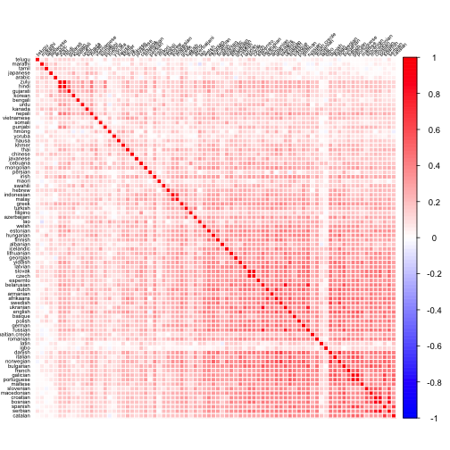 

```r
mean(cmat)
```

```
## [1] 0.3213
```

```r
## Correlations between all lengths, open class words only
xlingO = xling[xling$Open_class != 0,lens] 
names(xlingO) = as.character(tolower(lapply(str_split(names(xlingO),"_"),function(x) {x[1]})))

# Correlations between all lenghts
cmat = cor(xlingO, use = "pairwise.complete.obs")
corrplot(cmat,  tl.cex=.5, tl.srt=45, method = "color", tl.col = "black" ,col =col1(100), order = "FPC")
```

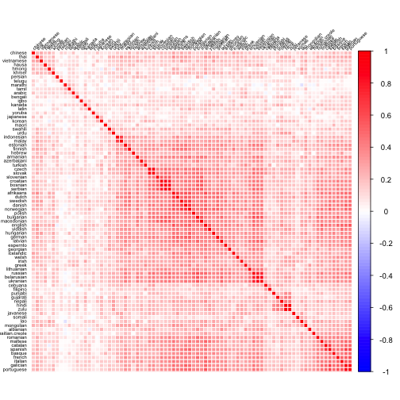 

```r
mean(cmat)
```

```
## [1] 0.2876
```
<a name="1c"/>
###  ( C ) Correlation between all lengths, controling for frequency

```r
## all words
xling_len_p = xling[,c(lens, which(names(xling)== "log.e.freq"))] 
names(xling_len_p) = as.character(tolower(lapply(str_split(names(xling_len_p),"_"),function(x) {x[1]})))

# correlations between all lengths, open class only
cmat.p = partial.r(xling_len_p,1:80,81 ) 
mean(cmat.p)
```

```
## [1] 0.216
```

```r
## open class words only
xlingOF = xling[xling$Open_class !=0 ,c(lens, which(names(xling)== "log.e.freq"))] 
names(xlingOF) = as.character(tolower(lapply(str_split(names(xlingOF),"_"),function(x) {x[1]})))

# correlations between all lengths, open class only
cmat.p = partial.r(xlingOF,1:80,81 ) 

# sorted by first principle component
if (savePlots) {pdf('sort.pdf',height = 10, width = 10)}
corrplot(cmat.p,  tl.cex=.5, tl.srt=45,  order = "FPC", method = "color", tl.col = "black" ,col =col1(100))
```

 

```r
if (savePlots) {dev.off() }
# sorted by  angular order of the eigenvectors.
corrplot(cmat.p,  tl.cex=.5, tl.srt=45,  order = "AOE", method = "color", tl.col = "black" ,col =col1(100))
```

 

```r
# sorted by hierarchical clustering
corrplot(cmat.p,  tl.cex=.5, tl.srt=45,  order = "hclus", method = "color", tl.col = "black", col =col1(100) )
```

 

```r
mean(cmat.p)
```

```
## [1] 0.2201
```


<a name="1d"/>
###  (D) Correlation between  lengths and complexity, open class only, controling for frequency


```r
c_l$checked_only = ifelse(c_l$Checked == "yes", c_l$corr, 0)
c_l$uci = ifelse(c_l$Checked == "yes",  c_l$upper.ci, 0)
c_l$lci = ifelse(c_l$Checked == "yes",  c_l$lower.ci, 0)

### Plot with bootsrapped CIs on pearsons are, and parial frequencies
if (savePlots) {pdf("figure/p0.pdf", width = 10, height = 6 )}
ggplot(c_l, aes(language, 0, fill = Checked)) + 
  geom_bar(stat = "identity", ) + 
  ylab("Pearson's r") + xlab("Language") + 
  #ggtitle("Correlation between word length and complexity norms") +
  theme(axis.text.x = element_text(angle = 90, hjust = 1)) +
  #geom_linerange(aes(ymax=uci, ymin=lci)) +
  #geom_point(data=c_l, mapping=aes(x=language, y=p.corr), size=2, shape = 17) +
  #geom_hline(y=mean(c_l$corr),lty=2) +
  theme(
    plot.background = element_blank()
   ,panel.grid.major = element_blank()
   ,panel.grid.minor = element_blank()
   #,panel.border = element_blank()
  )  +
  theme(axis.title.x = element_text( size=25), axis.text.x  = element_text( size=10),
        axis.title.y = element_text( size=25), axis.text.y  = element_text( size=10)) +
  theme(legend.text = element_text(size = 10), legend.title = element_text(size = 10)) +
 # annotate("text", x = 75, y =mean(c_l$corr) + .02 , label=paste("M=",round(mean(c_l$corr),2), sep = "")) +
  scale_fill_manual(values=c("pink", "red")) +
  theme(legend.position="none") +
 scale_y_continuous(limits = c(-.07, .7)) 
```

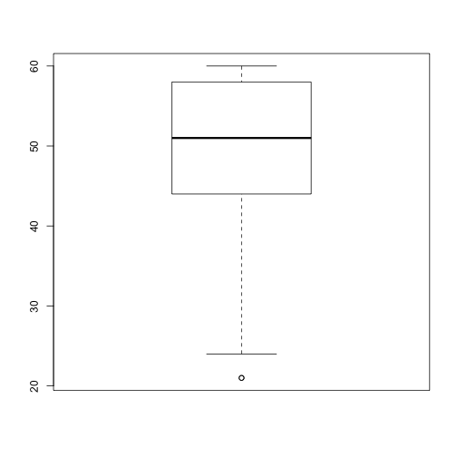 

```r
if (savePlots) {dev.off()}

if (savePlots) {pdf("figure/p1.pdf", width = 10, height = 6 )}
ggplot(c_l, aes(language, checked_only, fill = Checked)) + 
  geom_bar(stat = "identity", ) + 
  ylab("Pearson's r") + xlab("Language") + 
  #ggtitle("Correlation between word length and complexity norms") +
  theme(axis.text.x = element_text(angle = 90, hjust = 1)) +
  geom_linerange(aes(ymax=uci, ymin=lci)) +
  #geom_point(data=c_l, mapping=aes(x=language, y=p.corr), size=2, shape = 17) +
  #geom_hline(y=mean(c_l$corr),lty=2) +
  theme(
    plot.background = element_blank()
   ,panel.grid.major = element_blank()
   ,panel.grid.minor = element_blank()
   #,panel.border = element_blank()
  )  +
  theme(axis.title.x = element_text( size=25), axis.text.x  = element_text( size=10),
        axis.title.y = element_text( size=25), axis.text.y  = element_text( size=10)) +
  theme(legend.text = element_text(size = 10), legend.title = element_text(size = 10)) +
 # annotate("text", x = 75, y =mean(c_l$corr) + .02 , label=paste("M=",round(mean(c_l$corr),2), sep = "")) +
  scale_fill_manual(values=c("pink", "red")) +
  theme(legend.position="none") +
   scale_y_continuous(limits = c(-.07, .7)) 
```

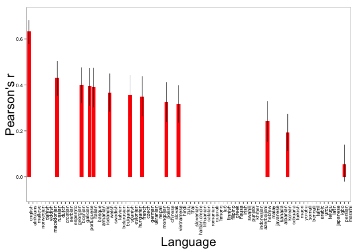 

```r
if (savePlots) {dev.off()}

### Plot with bootsrapped CIs on pearsons are, and parial frequencies
if (savePlots) {pdf("figure/p2.pdf", width = 10, height = 6 )}

ggplot(c_l, aes(language, corr, fill = Checked)) + 
  geom_bar(stat = "identity", ) + 
  ylab("Pearson's r") + xlab("Language") + 
  #ggtitle("Correlation between word length and complexity norms") +
  theme(axis.text.x = element_text(angle = 90, hjust = 1)) +
  geom_linerange(aes(ymax=upper.ci, ymin=lower.ci)) +
  #geom_point(data=c_l, mapping=aes(x=language, y=p.corr), size=2, shape = 17) +
  geom_hline(y=mean(c_l$corr),lty=2) +
  theme(
    plot.background = element_blank()
   ,panel.grid.major = element_blank()
   ,panel.grid.minor = element_blank()
   #,panel.border = element_blank()
  )  +
  theme(axis.title.x = element_text( size=25), axis.text.x  = element_text( size=10),
        axis.title.y = element_text( size=25), axis.text.y  = element_text( size=10)) +
  theme(legend.text = element_text(size = 10), legend.title = element_text(size = 10)) +
 # annotate("text", x = 75, y =mean(c_l$corr) + .02 , label=paste("M=",round(mean(c_l$corr),2), sep = "")) +
  scale_fill_manual(values=c("pink", "red")) +
  theme(legend.position="none") +
 scale_y_continuous(limits = c(-.07, .7)) 
```

 

```r
if (savePlots) {dev.off()}

if (savePlots) {pdf("figure/p3.pdf", width = 10, height = 6 ) }
ggplot(c_l, aes(language, corr, fill = Checked)) + 
  geom_bar(stat = "identity", ) + 
  ylab("Pearson's r") + xlab("Language") + 
  #ggtitle("Correlation between word length and complexity norms") +
  theme(axis.text.x = element_text(angle = 90, hjust = 1)) +
  geom_linerange(aes(ymax=upper.ci, ymin=lower.ci)) +
  geom_point(data=c_l, mapping=aes(x=language, y=p.corr), size=2, shape = 17) +
  geom_hline(y=mean(c_l$corr),lty=2) +
  theme(
    plot.background = element_blank()
   ,panel.grid.major = element_blank()
   ,panel.grid.minor = element_blank()
   #,panel.border = element_blank()
  )  +
  theme(axis.title.x = element_text( size=25), axis.text.x  = element_text( size=10),
        axis.title.y = element_text( size=25), axis.text.y  = element_text( size=10)) +
  theme(legend.text = element_text(size = 10), legend.title = element_text(size = 10)) +
 # annotate("text", x = 75, y =mean(c_l$corr) + .02 , label=paste("M=",round(mean(c_l$corr),2), sep = "")) +
  scale_fill_manual(values=c("pink", "red")) +
  theme(legend.position="none") +
  scale_y_continuous(limits = c(-.07, .7)) 
```

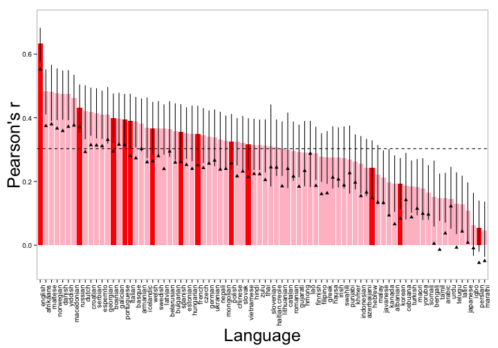 

```r
if (savePlots) {dev.off()}

#verify correlations by looking at English
partial.r(xlingOC,c(1,which(names(xlingOC) == "complexity")), which(names(xlingOC) == "log.e.freq"))
```

```
## partial correlations 
##            english complexity
## english       1.00       0.55
## complexity    0.55       1.00
```

```r
cor(xlingOC$english,xlingOC$complexity, use = "pairwise")
```

```
## [1] 0.6328
```


```r
# mean correlation
mean(c_l$corr)
```

```
## [1] 0.3028
```

***
***

<a name="HF"/>
## (2) High frequency words in mapping task  [(Task)][task32]

### read in data and prep variables


### merge in stuff


### get quintiles

### aggregate by word

```r
ms <- aggregate(LongBet  ~ engWord + complexity + log.e.freq + complexity_cil + complexity_cih + quintile, data=d, mean)
ms$bet_cil <- aggregate(LongBet  ~ engWord + complexity + log.e.freq + complexity_cil + complexity_cih, data=d, ci.low)$LongBet 
ms$bet_cih <- aggregate(LongBet  ~ engWord + complexity + log.e.freq + complexity_cil + complexity_cih, data=d, ci.high)$LongBet  
```

### plot bet to long word vs. complexity norms

```r
ggplot(ms, aes(norms.lf, LongBet)) +
  geom_point() + 
  geom_smooth(method = "lm", color="blue", formula = y ~ x) +
  geom_errorbarh(aes(xmin=complexity_cil, xmax=complexity_cih), size=0.2, colour="grey") +
  geom_errorbar(aes(ymin=bet_cil, ymax=bet_cih), size=0.2, colour="grey") +
  annotate("text", x=6, y=25, label=paste("r=",round(cor(ms$norms.lf, ms$LongBet, use = "complete"), 2)))+
  xlab("Complexity Norms") +
  ylab("Bet to Long Word") +
  geom_vline(xintercept = q, col = "red") +
  ggtitle("High Frequency meanings (words)")
```

```
## Error: 'x' must be numeric
```

### correlation between norms and length

```r
# correlation between norms and bets to long word (all)
cor.test(d$LongBet,d$complexity)
```

```
## 
## 	Pearson's product-moment correlation
## 
## data:  d$LongBet and d$complexity
## t = 3.359, df = 628, p-value = 0.0008291
## alternative hypothesis: true correlation is not equal to 0
## 95 percent confidence interval:
##  0.05532 0.20880
## sample estimates:
##    cor 
## 0.1329
```

```r
bm.partial(d$LongBet,d$complexity, d$log.e.freq )
```

```
## [1] 0.1341
```

```r
#partial.r(d[,c(4,8,10)],c(1,2),3 )

# correlation between norms and bets to long word (aggregated across words)
cor.test(ms$LongBet,ms$complexity)
```

```
## 
## 	Pearson's product-moment correlation
## 
## data:  ms$LongBet and ms$complexity
## t = 3.318, df = 94, p-value = 0.001289
## alternative hypothesis: true correlation is not equal to 0
## 95 percent confidence interval:
##  0.1319 0.4923
## sample estimates:
##    cor 
## 0.3238
```

```r
bm.partial(ms$LongBet,ms$complexity, ms$log.e.freq  )
```

```
## [1] 0.3228
```

```r
summary(lmer(LongBet ~ complexity + log.e.freq + (1|trial) + (1|workerid), d))
```

```
## Linear mixed model fit by REML ['lmerMod']
## Formula: LongBet ~ complexity + log.e.freq + (1 | trial) + (1 | workerid)
##    Data: d
## 
## REML criterion at convergence: 5614
## 
## Scaled residuals: 
##     Min      1Q  Median      3Q     Max 
## -2.2126 -0.7710  0.0463  0.7391  2.4127 
## 
## Random effects:
##  Groups   Name        Variance Std.Dev.
##  workerid (Intercept)  32.6     5.71   
##  trial    (Intercept)   0.0     0.00   
##  Residual             620.5    24.91   
## Number of obs: 604, groups: workerid, 63; trial, 10
## 
## Fixed effects:
##             Estimate Std. Error t value
## (Intercept)    47.26       4.96    9.52
## complexity      3.60       1.06    3.39
## log.e.freq     -3.19       1.11   -2.88
## 
## Correlation of Fixed Effects:
##            (Intr) cmplxt
## complexity -0.680       
## log.e.freq -0.688 -0.002
```

### plot by quintiles

```r
#aggregate by quintile
ms <- aggregate(LongBet  ~ quintile , data=d, mean)
ms$bet_cil <- aggregate(LongBet  ~ quintile, data=d, ci.low)$LongBet  
ms$bet_cih <- aggregate(LongBet  ~ quintile, data=d, ci.high)$LongBet  

ggplot(ms, aes(quintile, LongBet)) +
  geom_point() + 
  geom_smooth(method = "lm", color="blue", formula = y ~ x) +
  geom_errorbar(aes(ymin=bet_cil, ymax=bet_cih), size=0.2, colour="black") +
  annotate("text", x=5, y=25, label=paste("r=",round(cor(ms$quintile, ms$LongBet, use = "complete"), 2)))+
  scale_y_continuous(limits = c(20, 80)) +
  #scale_x_continuous(limits = c(0, 7), breaks = 1:7, labels = 1:7)  +
  theme(axis.title=element_text(size=20), axis.text=element_text(size=15)) +
  xlab("Complexity Norm quintile") +
  ylab("Bet to Long Word") +
  ggtitle("High Frequency meanings (words)")
```

 

### correlations with quintiles

```r
# correlation between norms quintiles and bets to long word 
cor.test(d$quintile, d$LongBet)
```

```
## 
## 	Pearson's product-moment correlation
## 
## data:  d$quintile and d$LongBet
## t = 3.825, df = 628, p-value = 0.0001438
## alternative hypothesis: true correlation is not equal to 0
## 95 percent confidence interval:
##  0.07364 0.22634
## sample estimates:
##    cor 
## 0.1509
```

```r
# correlation between norms quintiles and bets to long word (aggregated across words)
cor.test(ms$quintile, ms$LongBet)
```

```
## 
## 	Pearson's product-moment correlation
## 
## data:  ms$quintile and ms$LongBet
## t = 3.291, df = 3, p-value = 0.04605
## alternative hypothesis: true correlation is not equal to 0
## 95 percent confidence interval:
##  0.01205 0.99239
## sample estimates:
##    cor 
## 0.8849
```

### residual quintiles (controls for frequency)
### get quintiles


###Plot

```r
#aggregate by quintile
ms.qr <- aggregate(LongBet  ~ resid.quintile , data=d, mean)
ms.qr$bet_cil <- aggregate(LongBet  ~ resid.quintile, data=d, ci.low)$LongBet  
ms.qr$bet_cih <- aggregate(LongBet  ~ resid.quintile, data=d, ci.high)$LongBet  

ggplot(ms.qr, aes(resid.quintile, LongBet)) +
  geom_point() + 
  geom_smooth(method = "lm", color="blue", formula = y ~ x) +
  geom_errorbar(aes(ymin=bet_cil, ymax=bet_cih), size=0.2, colour="black") +
  annotate("text", x=5, y=25, label=paste("r=",round(cor(d$resid.quintile, d$LongBet, use = "complete"), 2)))+
  scale_y_continuous(limits = c(20, 80)) +
  #scale_x_continuous(limits = c(0, 7), breaks = 1:7, labels = 1:7)  +
  theme(axis.title=element_text(size=20), axis.text=element_text(size=15)) +
  xlab("RESIDUAL Complexity Norm quintile") +
  ylab("Bet to Long Word") +
ggtitle("High Frequency meanings (words)")
```

```
## Warning: NaNs produced
```

 

### residual quintiles correlations

```r
cor.test(d$resid.quintile, d$LongBet) ### highly correlated
```

```
## 
## 	Pearson's product-moment correlation
## 
## data:  d$resid.quintile and d$LongBet
## t = 1.545, df = 628, p-value = 0.1228
## alternative hypothesis: true correlation is not equal to 0
## 95 percent confidence interval:
##  -0.01665  0.13899
## sample estimates:
##     cor 
## 0.06154
```

```r
cor.test(ms.qr$resid.quintile, ms.qr$LongBet) 
```

```
## Error: not enough finite observations
```
***
***
<a name="novelRealObjs"/>
## (3) Novel real objects

<a name="3a"/>
### (A) Norms [Complexity norming task][task30] [RT task][task9]

### Complexity Norms


## Get reliability between two samples

```r
  cor(co_norms$rating_1, co_norms$rating_2)
```

```
## [1] 0.8664
```

### Complexity Norms


<a name="3b"/>
### (B) Mapping task (adults) [(Task)][task34]

### read in data and format


### make everything factors


### merge in norms


### get effect sizes


### get obj conds


### ratio plots

```r
ggplot(de, aes(y=effect_size, x=objRatio)) +
  geom_pointrange(aes(ymax = cill, ymin=ciul))+
  geom_hline(yintercept=0,lty=2) +
  stat_smooth(method="lm") +
  geom_text(aes(objRatio+.03, effect_size, label=objCondition)) +
  ylab("effect size") +
  xlab("object ratio") +
  theme(text = element_text(size=20), plot.title = element_text(size=20)) +
  ggtitle("Object ratio vs. effect size") +
  annotate("text", x=.3, y=-.2, col = "red",label=paste("r=",round(cor(de$effect_size, de$objRatio, use = "complete"), 2)))
```

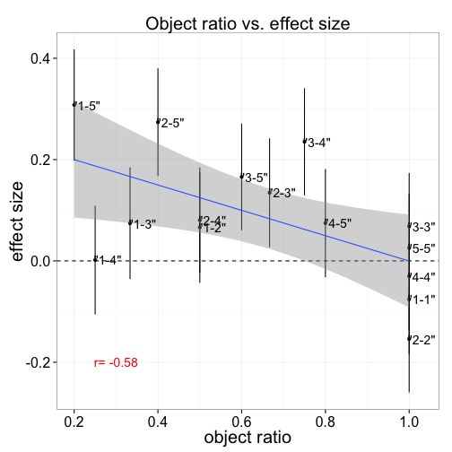 

```r
ggplot(de, aes(y=effect_size, x=c.Mratio)) +
  geom_pointrange(aes(ymax = cill, ymin=ciul),position="dodge")+
  geom_hline(yintercept=0,lty=2) +
  stat_smooth(method="lm") +
  geom_text(aes(c.Mratio+.02, effect_size, label=objCondition), position="dodge") +
  ylab("effect size") +
  xlab("object ratio") + 
  ggtitle("complexity ratio vs. effect size") +
  theme(text = element_text(size=20), plot.title = element_text(size=20)) +
  annotate("text", x=.5, y=-.2, col = "red",label=paste("r=",round(cor(de$effect_size, de$c.Mratio, use = "complete"), 2)))
```

```
## ymax not defined: adjusting position using y instead
```

 

```r
ggplot(de, aes(y=effect_size, x=rt.Mratio)) +
  geom_pointrange( aes(ymax = cill, ymin=ciul))+
  geom_hline(yintercept=0,lty=2) +
  stat_smooth(method="lm") +
  geom_text(aes(rt.Mratio+.0008, effect_size, label=objCondition)) +
  ylab("effect size") +
  xlab("RT ratio") +
   ggtitle("RT ratio vs. effect size") +
  theme(text = element_text(size=20), plot.title = element_text(size=20)) +
  annotate("text", x=.985, y=-.2, col = "red",label=paste("r=",round(cor(de$effect_size, de$rt.Mratio, use = "complete"), 2)))
```

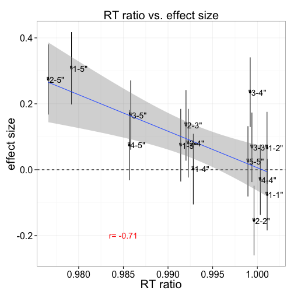 

### correlations between effect size at complexity conditions

```r
cor.test(de$objRatio, de$effect_size)
```

```
## 
## 	Pearson's product-moment correlation
## 
## data:  de$objRatio and de$effect_size
## t = -2.579, df = 13, p-value = 0.02288
## alternative hypothesis: true correlation is not equal to 0
## 95 percent confidence interval:
##  -0.84288 -0.09913
## sample estimates:
##     cor 
## -0.5818
```

```r
cor.test(de$c.Mratio, de$effect_size)
```

```
## 
## 	Pearson's product-moment correlation
## 
## data:  de$c.Mratio and de$effect_size
## t = -3.34, df = 13, p-value = 0.005319
## alternative hypothesis: true correlation is not equal to 0
## 95 percent confidence interval:
##  -0.8841 -0.2567
## sample estimates:
##     cor 
## -0.6796
```

```r
cor.test(de$rt.Mratio, de$effect_size)
```

```
## 
## 	Pearson's product-moment correlation
## 
## data:  de$rt.Mratio and de$effect_size
## t = -3.596, df = 13, p-value = 0.003254
## alternative hypothesis: true correlation is not equal to 0
## 95 percent confidence interval:
##  -0.8948 -0.3039
## sample estimates:
##     cor 
## -0.7062
```

<a name="3c"/>
### (C) Mapping task (children) [(Task)][task15]

<a name="3d"/>
### (D) Production task (labels + desecriptions) 
### (1) Labels [(Task)][task27]
### read in data and prep data frame


### relationship between condition and description length

```r
t.test(md[md$condition == '"complex"',"log.length"],md[md$condition == '"simple"',"log.length"],paired = TRUE)
```

```
## 
## 	Paired t-test
## 
## data:  md[md$condition == "\"complex\"", "log.length"] and md[md$condition == "\"simple\"", "log.length"]
## t = 2.281, df = 158, p-value = 0.02388
## alternative hypothesis: true difference in means is not equal to 0
## 95 percent confidence interval:
##  0.009666 0.134439
## sample estimates:
## mean of the differences 
##                 0.07205
```

```r
summary(lmer(log.length~condition + (1+trial|workerid), md))
```

```
## Linear mixed model fit by REML ['lmerMod']
## Formula: log.length ~ condition + (1 + trial | workerid)
##    Data: md
## 
## REML criterion at convergence: -4.3
## 
## Scaled residuals: 
##     Min      1Q  Median      3Q     Max 
## -2.3587 -0.6508  0.0949  0.6205  2.4845 
## 
## Random effects:
##  Groups   Name        Variance Std.Dev. Corr 
##  workerid (Intercept) 1.97e-02 0.140280      
##           trial       4.23e-09 0.000065 -1.00
##  Residual             4.76e-02 0.218224      
## Number of obs: 318, groups: workerid, 33
## 
## Fixed effects:
##                   Estimate Std. Error t value
## (Intercept)         1.9322     0.0301    64.3
## condition"simple"  -0.0717     0.0245    -2.9
## 
## Correlation of Fixed Effects:
##             (Intr)
## cndtn"smpl" -0.412
```

### relationship with complicated norms

```r
index <- match(md$picture, co_norms$ratingNum)
md$c.norms <- co_norms$meanRating[index]

ms <- aggregate(log.length ~ c.norms + picture, data=md, mean)
ms$cih <- aggregate(log.length ~ c.norms + picture, data=md, ci.high)$log.length
ms$cil <- aggregate(log.length ~ c.norms + picture, data=md, ci.low)$log.length

#plot
ggplot(ms, aes(c.norms,log.length)) +
  geom_point() + 
  geom_smooth(method = "lm", color="blue", formula = y ~ x) +
  geom_errorbar(aes(ymax=log.length+cih,ymin=log.length-cil), size=0.2, colour="grey") +
  theme_bw() +
  xlab("Object Complexity Norms") +
  ylab("Log Word Length (characters)") +
  theme(axis.title=element_text(size=20), axis.text=element_text(size=15)) 
```

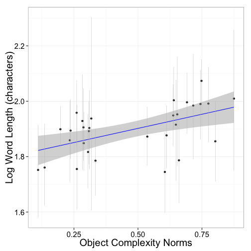 

### relationship with RT norms

```r
index <- match(md$picture, rto_norms$Answer.train_image)
md$rt.norms <- rto_norms$log.rt[index]

ms <- aggregate(log.length ~ rt.norms + picture, data=md, mean)
ms$cih <- aggregate(log.length ~ rt.norms + picture, data=md, ci.high)$log.length
ms$cil <- aggregate(log.length ~ rt.norms + picture, data=md, ci.low)$log.length

#plot
ggplot(ms, aes(rt.norms,log.length)) +
  geom_point() + 
  geom_smooth(method = "lm", color="blue", formula = y ~ x) +
  geom_errorbar(aes(ymax=log.length+cih,ymin=log.length-cil), size=0.2, colour="grey") +
  theme_bw() +
  xlab("Object Complexity Norms") +
  ylab("Log Word Length (characters)") +
  theme(axis.title=element_text(size=20), axis.text=element_text(size=15)) 
```

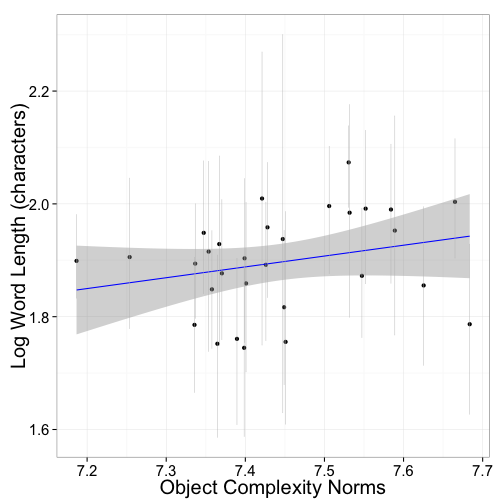 

### (2) Descriptions [(Task)][task25]
### read in data and prep data frame


### relationship between condition and description length

```r
#summary(lmer(length_c~condition + (1|workerid), md))
#summary(lmer(length_c~condition + trial + (1+trial|workerid), md))

summary(lmer(log.length_c~md$condition + (1|workerid), md))
```

```
## Linear mixed model fit by REML ['lmerMod']
## Formula: log.length_c ~ md$condition + (1 | workerid)
##    Data: md
## 
## REML criterion at convergence: 316.5
## 
## Scaled residuals: 
##     Min      1Q  Median      3Q     Max 
## -3.1489 -0.6948  0.0775  0.6412  2.2162 
## 
## Random effects:
##  Groups   Name        Variance Std.Dev.
##  workerid (Intercept) 0.366    0.605   
##  Residual             0.156    0.395   
## Number of obs: 240, groups: workerid, 24
## 
## Fixed effects:
##                      Estimate Std. Error t value
## (Intercept)             3.308      0.129   25.69
## md$condition"simple"   -0.140      0.051   -2.75
## 
## Correlation of Fixed Effects:
##             (Intr)
## md$cndtn"s" -0.198
```

```r
summary(lmer(log.length_c~condition + trial + (1+trial|workerid), md))
```

```
## Linear mixed model fit by REML ['lmerMod']
## Formula: log.length_c ~ condition + trial + (1 + trial | workerid)
##    Data: md
## 
## REML criterion at convergence: 319.3
## 
## Scaled residuals: 
##    Min     1Q Median     3Q    Max 
## -3.248 -0.667  0.064  0.619  2.302 
## 
## Random effects:
##  Groups   Name        Variance Std.Dev. Corr 
##  workerid (Intercept) 0.45997  0.6782        
##           trial       0.00116  0.0341   -0.50
##  Residual             0.14561  0.3816        
## Number of obs: 240, groups: workerid, 24
## 
## Fixed effects:
##                   Estimate Std. Error t value
## (Intercept)        3.36458    0.14971   22.47
## condition"simple" -0.14480    0.05057   -2.86
## trial             -0.00996    0.01108   -0.90
## 
## Correlation of Fixed Effects:
##             (Intr) cndt""
## cndtn"smpl" -0.136       
## trial       -0.524 -0.081
```

```r
## plot
ggplot(md, aes(x=log.length_c, fill=condition)) + geom_density(alpha = 0.2)
```

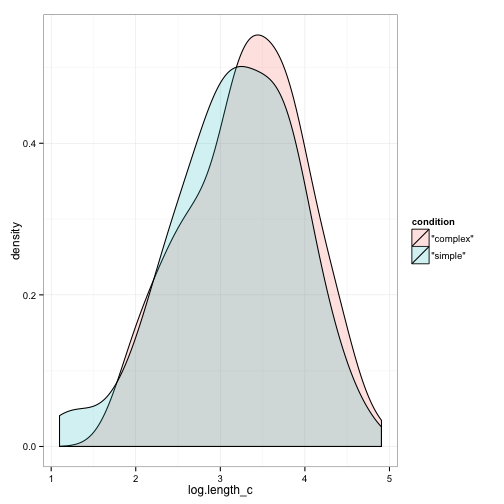 

### correlations with complexity norms

```r
index <- match(md$picture, co_norms$ratingNum)
md$c.norms <- co_norms$meanRating[index]

summary(lmer(log.length_c~c.norms + (1+trial|workerid), md))
```

```
## Linear mixed model fit by REML ['lmerMod']
## Formula: log.length_c ~ c.norms + (1 + trial | workerid)
##    Data: md
## 
## REML criterion at convergence: 307
## 
## Scaled residuals: 
##    Min     1Q Median     3Q    Max 
## -3.287 -0.686  0.082  0.639  2.248 
## 
## Random effects:
##  Groups   Name        Variance Std.Dev. Corr 
##  workerid (Intercept) 0.46257  0.6801        
##           trial       0.00112  0.0334   -0.52
##  Residual             0.14287  0.3780        
## Number of obs: 240, groups: workerid, 24
## 
## Fixed effects:
##             Estimate Std. Error t value
## (Intercept)    3.035      0.133   22.79
## c.norms        0.390      0.107    3.64
## 
## Correlation of Fixed Effects:
##         (Intr)
## c.norms -0.366
```

```r
summary(lmer(log.length_c~c.norms + trial + (1|workerid), md))
```

```
## Linear mixed model fit by REML ['lmerMod']
## Formula: log.length_c ~ c.norms + trial + (1 | workerid)
##    Data: md
## 
## REML criterion at convergence: 317.3
## 
## Scaled residuals: 
##    Min     1Q Median     3Q    Max 
## -3.172 -0.685  0.079  0.658  2.234 
## 
## Random effects:
##  Groups   Name        Variance Std.Dev.
##  workerid (Intercept) 0.365    0.604   
##  Residual             0.153    0.391   
## Number of obs: 240, groups: workerid, 24
## 
## Fixed effects:
##             Estimate Std. Error t value
## (Intercept)  3.11425    0.14684   21.21
## c.norms      0.36270    0.10971    3.31
## trial       -0.00891    0.00886   -1.01
## 
## Correlation of Fixed Effects:
##         (Intr) c.nrms
## c.norms -0.396       
## trial   -0.376  0.123
```

```r
# complexity norms predict length

cor.test(md$log.length_c,md$c.norms)
```

```
## 
## 	Pearson's product-moment correlation
## 
## data:  md$log.length_c and md$c.norms
## t = 2.102, df = 238, p-value = 0.03657
## alternative hypothesis: true correlation is not equal to 0
## 95 percent confidence interval:
##  0.008547 0.257262
## sample estimates:
##   cor 
## 0.135
```
### complexity norms plot

```r
ms <- aggregate(log.length_c ~ c.norms + picture, data=md, mean)
ms$cih <- aggregate(log.length_c ~ c.norms + picture, data=md, ci.high)$log.length_c
ms$cil <- aggregate(log.length_c ~ c.norms + picture, data=md, ci.low)$log.length_c

ggplot(ms, aes(c.norms,log.length_c)) +
  geom_point() + 
  geom_smooth(method = "lm", color="blue", formula = y ~ x) +
  geom_errorbar(aes(ymax=log.length_c+cih,ymin=log.length_c-cil), size=0.2, colour="grey") +
  theme_bw() +
  xlab("Object Complexity Norms") +
  ylab("Log Description Length (characters)") +
  theme(axis.title=element_text(size=20), axis.text=element_text(size=15)) 
```

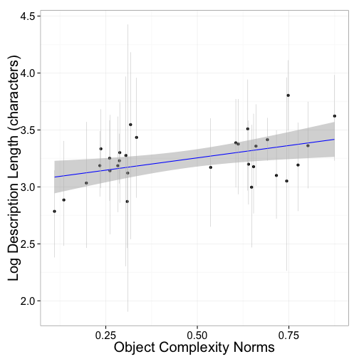 

### correlations with RT norms

```r
index <- match(md$picture, rto_norms$Answer.train_image)
md$rt.norms <- rto_norms$log.rt[index]

summary(lmer(log.length_c~rt.norms + (1+trial|workerid), md))
```

```
## Linear mixed model fit by REML ['lmerMod']
## Formula: log.length_c ~ rt.norms + (1 + trial | workerid)
##    Data: md
## 
## REML criterion at convergence: 314.1
## 
## Scaled residuals: 
##    Min     1Q Median     3Q    Max 
## -3.406 -0.675  0.082  0.648  2.082 
## 
## Random effects:
##  Groups   Name        Variance Std.Dev. Corr 
##  workerid (Intercept) 0.45846  0.677         
##           trial       0.00115  0.034    -0.48
##  Residual             0.14828  0.385         
## Number of obs: 240, groups: workerid, 24
## 
## Fixed effects:
##             Estimate Std. Error t value
## (Intercept)   -0.298      1.688   -0.18
## rt.norms       0.473      0.226    2.09
## 
## Correlation of Fixed Effects:
##          (Intr)
## rt.norms -0.997
```

```r
summary(lmer(log.length_c~rt.norms + trial + (1|workerid), md))
```

```
## Linear mixed model fit by REML ['lmerMod']
## Formula: log.length_c ~ rt.norms + trial + (1 | workerid)
##    Data: md
## 
## REML criterion at convergence: 323.5
## 
## Scaled residuals: 
##    Min     1Q Median     3Q    Max 
## -3.281 -0.611  0.081  0.669  2.348 
## 
## Random effects:
##  Groups   Name        Variance Std.Dev.
##  workerid (Intercept) 0.369    0.608   
##  Residual             0.158    0.398   
## Number of obs: 240, groups: workerid, 24
## 
## Fixed effects:
##             Estimate Std. Error t value
## (Intercept)  0.29437    1.71606    0.17
## rt.norms     0.40388    0.22940    1.76
## trial       -0.01131    0.00897   -1.26
## 
## Correlation of Fixed Effects:
##          (Intr) rt.nrm
## rt.norms -0.997       
## trial    -0.105  0.076
```

```r
#rt norms predict length

cor.test(md$log.length_c,md$rt.norms)
```

```
## 
## 	Pearson's product-moment correlation
## 
## data:  md$log.length_c and md$rt.norms
## t = 0.3863, df = 238, p-value = 0.6996
## alternative hypothesis: true correlation is not equal to 0
## 95 percent confidence interval:
##  -0.1019  0.1512
## sample estimates:
##     cor 
## 0.02503
```

### rt norms plot

```r
ms <- aggregate(log.length_c ~ rt.norms + picture, data=md, mean)
ms$cil <- aggregate(log.length_c ~ rt.norms + picture, data=md, ci.low)$log.length_c
ms$cih <- aggregate(log.length_c ~ rt.norms + picture, data=md, ci.high)$log.length_c

ggplot(ms, aes(rt.norms,log.length_c)) +
  geom_point() + 
  geom_smooth(method = "lm", color="blue", formula = y ~ x) +
  geom_errorbar(aes(ymax=log.length_c+cih,ymin=log.length_c-cil), size=0.2, colour="grey") +
  theme_bw() +
  xlab("Object RT Norms") +
  ylab("Log Description Length (characters)") +
  theme(axis.title=element_text(size=20), axis.text=element_text(size=15)) 
```

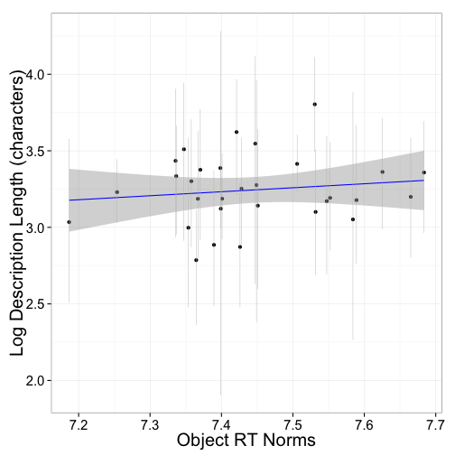 

```r
# reliable when control for random effects
```

***
***
<a name="geons"/>
## (4) Geons

<a name="4a"/>
### (A) Norms [(Complexity Task)][task34] [(RT task)][task35]
### (1) Complexity Norms 


### (2) RT Norms 


<a name="4b"/> 
### (B) Mapping task  [(Task)][task37] 


```r
#--READ IN DATA-- 
d <- read.csv("data/RefComplex38.results",sep="\t",header=TRUE)
 
if (removeRepeatSubj) {
    d = merge(d, dups, by=c("hitid","workerid"))
    d = d[d$repeatSubj == "unique",]
  }

# get in long form
md <- melt(d,id.vars=c("workerid", "assignmentaccepttime"),measure.vars=c(names(d)[c(grepl("_",names(d)))]))
```

```
## Error: id variables not found in data: assignmentaccepttime
```

```r
md$trial <- matrix(lapply(str_split(md$variable,"_"),function(x) {x[2]}))
```

```
## Error: replacement has 0 rows, data has 9640
```

```r
md$variable <- as.character(matrix(lapply(str_split(md$variable,"_"),function(x) {x[1]})))
```

```
## Error: replacement has 0 rows, data has 9640
```

```r
md$variable <- matrix(lapply(str_split(md$variable,"Answer."),function(x) {x[2]}))
```

```
## Error: replacement has 0 rows, data has 9640
```

```r
md$variable <- as.factor(as.character(md$variable))
```

```
## Error: replacement has 0 rows, data has 9640
```

```r
md$trial <- as.factor(as.character(md$trial))
md$value <- as.factor(as.character(md$value))
md$workerid <- as.factor(as.character(md$workerid))

md$seq <- with(md, ave(value, workerid,  variable, trial, FUN = seq_along))
```

```
## Error: object 'variable' not found
```

```r
dc1 = dcast(workerid + assignmentaccepttime + seq + trial ~ variable, data = md, value.var = "value")
```

```
## Error: object 'assignmentaccepttime' not found
```

```r
dc1$seq <- NULL
```

```
## Error: object 'dc1' not found
```

```r
#make everything factors
dc$criticalComplicated <- as.factor(dc$criticalComplicated)
dc$criticalSimple   <- as.factor(dc$criticalSimple)
dc$langCondition   <- as.factor(dc$langCondition)
dc$objCondition   <- as.factor(dc$objCondition)
dc$response   <- as.factor(dc$response)
dc$responseSide   <- as.factor(dc$responseSide)
dc$responseValue   <- as.factor(dc$responseValue)
dc$word <- as.factor(dc$word)

# merge in norms
#complicated
cg_norms = read.csv("data/complicatedNormsGeons_BYITEM.csv")

cg_norms$obj = as.character(paste("\"", cg_norms$obj, "\"", sep = ""))
index <- match(dc$criticalSimple, cg_norms$obj)
dc$criticalSimple_c.norms <- cg_norms$mean_rating[index]
index <- match(dc$criticalComplicated,cg_norms$obj)
dc$criticalComplicated_c.norms <- cg_norms$value[index]

#rt
rg_norms = read.csv("data/rtNormsGeons_BYITEM.csv")
index <- match(dc$criticalSimple, rg_norms$obj)
dc$criticalSimple_rt.norms <- rg_norms$log.rt [index]
index <- match(dc$criticalComplicated, rg_norms$obj)
dc$criticalComplicated_rt.norms <- rg_normslog.rt [index]
```

```
## Error: object 'rg_normslog.rt' not found
```

```r
dc$c.ratio = dc$criticalSimple_c.norms/dc$criticalComplicated_c.norms
```

```
## Error: replacement has 0 rows, data has 7560
```

```r
dc$rt.ratio = dc$criticalSimple_rt.norms/dc$criticalComplicated_rt.norms

#get effect sizes
de <- ddply(dc, .(objCondition), function (d) {d.fc(d)}, .inform = TRUE, .drop = TRUE)

#get obj conds
de$cond1 <- as.factor(unlist(matrix(lapply(str_split(de$objCondition ,"-"),function(x) {x[1]}))))
de$cond2 <- as.factor(unlist(matrix(lapply(str_split(de$objCondition ,"-"),function(x) {x[2]}))))
de$cond1<- as.factor(gsub("[[:punct:]]", "", de$cond1))
de$cond2<- as.numeric(gsub("[[:punct:]]", "", de$cond2))
de$objCondition2 = paste(de$cond1, "/", de$cond2, sep = "")
```

# Plot

```r
ggplot(de, aes(y=effect_size, x=rt.Mratio)) +
  geom_pointrange( aes(ymax = cill, ymin=ciul))+
  geom_hline(yintercept=0,lty=2) +
  stat_smooth(method="lm") +
  geom_text(aes(rt.Mratio + .0025, effect_size, label=objCondition2)) +
  ylab("effect size (cohen's d)") +
  xlab("RT ratio") + 
  theme(text = element_text(size=25)) +  
  scale_y_continuous(limits = c(-.33, .66)) +
  annotate("text", x=.997, y=.55, color = "red", size = 8,
   label=paste("r=",round(cor(de$effect_size, de$rt.Mratio), 2)))
```

```
## Warning: Removed 15 rows containing missing values (stat_smooth).
## Warning: Removed 15 rows containing missing values (geom_segment).
## Warning: Removed 15 rows containing missing values (geom_point).
## Warning: Removed 15 rows containing missing values (geom_text).
```

```
## Error: 'x' and 'units' must have length > 0
```

```r
ggplot(de, aes(y=effect_size, x=c.Mratio)) +
  geom_pointrange( aes(ymax = cill, ymin=ciul))+
  geom_hline(yintercept=0,lty=2) +
  stat_smooth(method="lm") +
  geom_text(aes(c.Mratio + .05, effect_size, label=objCondition2)) +
  ylab("effect size (cohen's d)") +
  xlab("complexity rating ratio") + 
  theme(text = element_text(size=25))  +
  scale_y_continuous(limits = c(-.33, .66)) +
  annotate("text", x=1.15, y=.55, color = "red", size = 8,
    label=paste("r=",round(cor(de$effect_size, de$c.Mratio), 2)))
```

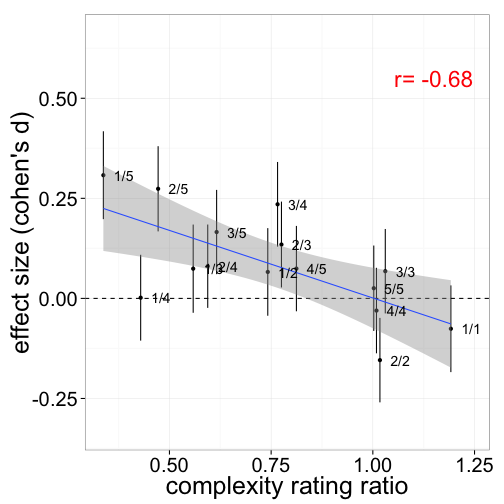 


```r
cor.test(de$rt.Mratio, de$effect_size)
```

```
## Error: not enough finite observations
```

```r
cor.test(de$c.Mratio, de$effect_size)
```

```
## 
## 	Pearson's product-moment correlation
## 
## data:  de$c.Mratio and de$effect_size
## t = -3.34, df = 13, p-value = 0.005319
## alternative hypothesis: true correlation is not equal to 0
## 95 percent confidence interval:
##  -0.8841 -0.2567
## sample estimates:
##     cor 
## -0.6796
```

[task30]: http://tinyurl.com/qz59yuh
[task32]: http://tinyurl.com/keznp7v
[task9]:  http://langcog.stanford.edu/expts/MLL/refComplex/Experiment9/ref_complex_9.html
[task26]: http://langcog.stanford.edu/expts/MLL/refComplex/Experiment26/ref_complex_26.html
[task34]: http://langcog.stanford.edu/expts/MLL/refComplex/Experiment34/ref_complex_34.html
[task15]: http://langcog.stanford.edu/expts/MLL/refComplex/Experiment15/ref_complex_15.html
[task25]: http://langcog.stanford.edu/expts/MLL/refComplex/Experiment25/ref_complex_25.html
[task27]: http://langcog.stanford.edu/expts/MLL/refComplex/Experiment27/ref_complex_27.html
[task34]: http://langcog.stanford.edu/expts/MLL/refComplex/Experiment34/ref_complex_34.html
[task35]: http://langcog.stanford.edu/expts/MLL/refComplex/Experiment35/ref_complex_35.html
[task37]: http://langcog.stanford.edu/expts/MLL/refComplex/Experiment37/ref_complex_37.html
