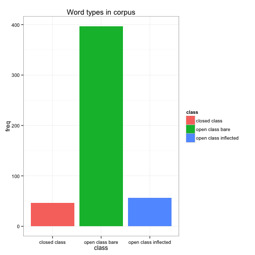
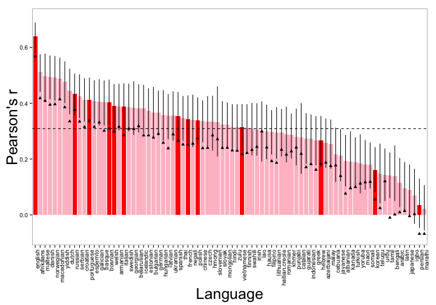
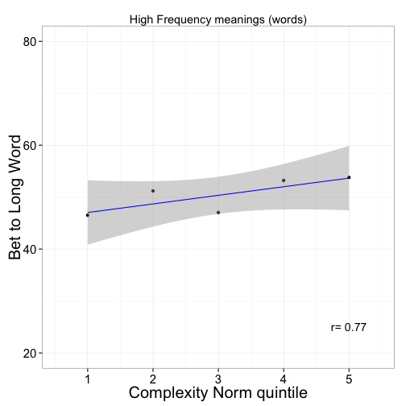
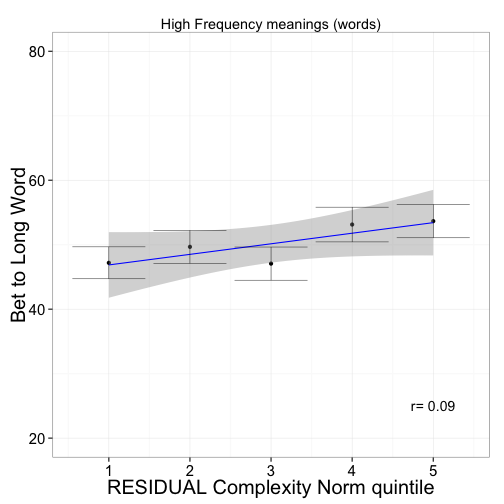
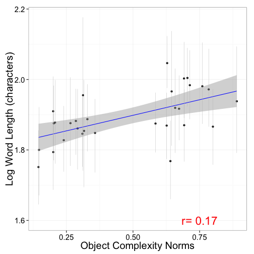
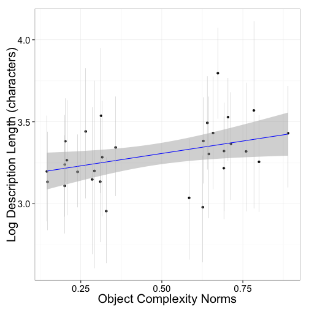
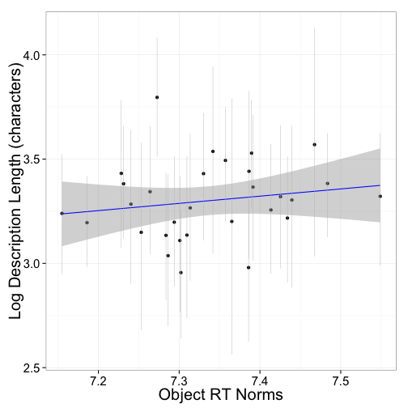

<h2> The length of words reflects their conceptual complexity </h2>
<h3>Supplementary Information </h3>

***
***

**TABLE OF CONTENTS**<br/>
&nbsp;&nbsp;&nbsp;&nbsp;&nbsp;&nbsp;&nbsp;**Study 1: [Geon mapping task](#1)** <br/>
&nbsp;&nbsp;&nbsp;&nbsp;&nbsp;&nbsp;&nbsp;**Study 2: [Geon complexity norms](#2)**<br/>
&nbsp;&nbsp;&nbsp;&nbsp;&nbsp;&nbsp;&nbsp;**Study 3: [Geon mapping task control (random syllables)](#3)**<br/>
&nbsp;&nbsp;&nbsp;&nbsp;&nbsp;&nbsp;&nbsp;**Study 4: [Real object complexity norms](#4)** <br/> 
&nbsp;&nbsp;&nbsp;&nbsp;&nbsp;&nbsp;&nbsp;**Study 5: [Real object mappping task](#5)**<br/> 
&nbsp;&nbsp;&nbsp;&nbsp;&nbsp;&nbsp;&nbsp;**Study 6: [Real object mapping task control (random syllables)](#6)** <br/> 
&nbsp;&nbsp;&nbsp;&nbsp;&nbsp;&nbsp;&nbsp;**Study 7: [Real object production task](#7)**<br/> 
&nbsp;&nbsp;&nbsp;&nbsp;&nbsp;&nbsp;&nbsp;**Study 8: [Geon study time task](#8)**<br/> 
&nbsp;&nbsp;&nbsp;&nbsp;&nbsp;&nbsp;&nbsp;**Study 9: [Real object study time task](#9)**<br/> 
&nbsp;&nbsp;&nbsp;&nbsp;&nbsp;&nbsp;&nbsp;**Study 10: [English complexity norms](#10)**<br/>
&nbsp;&nbsp;&nbsp;&nbsp;&nbsp;&nbsp;&nbsp;**Study 11: [Cross-linguistic analysis](#11)** <br/> 
&nbsp;&nbsp;&nbsp;&nbsp;&nbsp;&nbsp;&nbsp;**Study 12: [Simultaneous frequency task](#12)**<br/>
&nbsp;&nbsp;&nbsp;&nbsp;&nbsp;&nbsp;&nbsp;**Study 13: [Sequential frequency task](#12)**<br/>
  
This document was created from an R Markdown file. The R Markdown file can be found here. All analyses and plots can be reproduced from the raw data with the code in this file.

***
***


[A blurb about AMT?]

<a name="1"/>
<h3> Study 1: Geon mapping task</h3>

The task can be found <a href="http://langcog.stanford.edu/expts/MLL/refComplex/Experiment38/ref_complex_38.html" target="_blank"> here</a>. 

The short word items were: "bugorn," "ratum," "lopus," "wugnum," "torun," "gronan," "ralex," "vatrus." The long word items were:  "tupabugorn," "gaburatum," "fepolopus," "pakuwugnum," "mipatorun," "kibagronan," "tiburalex," "binivatrus."

Across all studies presented here, some participants completed more than one study. The results presented here include the data from all participants, but all reported results remain reliable when excluding participants who completed more than one study. Participants were counted as a repeat participant if they completed a study using the same stimuli (e.g., completed both Studies 1 and 2 with geons).

Plotted below is the effect size (bias to select complex alternative in long vs. short word condition) as a function of the complexity ratio between the two object alternatives. Each point corresponds to an object condition. Conditions are labeled by the quintiles of the two alternatives. For example, the "1/5" condition corresponds to the condition in which one alternative was from the first quintile and the other was from the fifth quintile. In the left plot, complexity is operationalized as the explicit complexity norms (Study 2). On the right, complexity is operationalized in terms of study times (Study 8). Effect sizes were calculated using the log odds ratio. In this and all subsequent plots, errors bars reflect  95% confidence intervals.


 


<a name="2"/>
<h3> Study 2: Geon complexity norms</h3> 

The task can be found <a href="http://langcog.stanford.edu/expts/MLL/refComplex/Experiment34/ref_complex_34.html" target="_blank"> here</a>.

The relationship between number of geons and complexity rating is plotted below. Each point corresponds to an object item (8 per condition). The x-coordinates have been jittered to avoid over-plotting.


 


<a name="3"/>
<h3> Study 3: Geon mapping task control</h3> 

The task can be found <a href="http://langcog.stanford.edu/expts/MLL/refComplex/Experiment40/ref_complex_40.html" target="_blank"> here</a>.

Plotted below is the proportion complex object selections as a function of the number of syllables in the target label. The dashed line reflects chance selection between the simple and complex alternatives. 


 


<a name="4"/>
<h3> Study 4: Real object complexity norms</h3> 

The task can be found <a href="http://langcog.stanford.edu/expts/MLL/refComplex/Experiment9/ref_complex_9.html" target="_blank"> here</a>.

Plotted below is the correlation between the two samples (_N_ = 60 each) of complexity norms. Each point corresponds to an object (_n_ = 60). 


 


<a name="5"/>
<h3> Study 5: Real object mapping task</h3> 

The task can be found <a href="http://langcog.stanford.edu/expts/MLL/refComplex/Experiment35/ref_complex_35.html" target="_blank"> here</a>.

The linguistic items were identical to Study 1.

Plotted below is the effect size (bias to select complex alternative in long vs. short word condition) as a function of the complexity ratio between the two object alternatives. Each point corresponds to an object condition. In the left plot, complexity is operationalized as the explicit complexity norms (Study 4). In the right plot, complexity is operationalized in terms of study times (Study 9). 


 

<a name="6"/>
<h3> Study 6: Real object mapping task control</h3> 

The task can be found <a href="http://langcog.stanford.edu/expts/MLL/refComplex/Experiment41/ref_complex_41.html" target="_blank"> here</a>.

Plotted below is the proportion of complex object selections as function of number of syllables. The dashed line reflects chance selection between simple and complex alternatives.


 


<a name="7"/>
<h3> Study 7: Real object production task</h3> 

The task can be found <a href="http://langcog.stanford.edu/expts/MLL/refComplex/Experiment27/ref_complex_27.html" target="_blank"> here</a>.

There were 26 productions (4%) that included more than one word. These productions were excluded. 

For each object, we analyzed the log length of the production in characters as a function of the complexity norms (Study 4, left below). Length of production was correlated with the complexity norms: Longer labels were coined for objects that were rated as more complex (_r_=.17, _p_<.0001). 

We also analyzed the log length of the production (in characters) as a function of study times (Study 9, right below). Length of production was correlated with study times: longer labels were cointed for objects that were studied longer (_r_=.16, _p_<.001). 


 


<a name="8"/>
<h3> Study 8: Geon study time task</h3> 

The task can be found <a href="http://langcog.stanford.edu/expts/MLL/refComplex/Experiment37/ref_complex_37.html" target="_blank"> here</a>.

We excluded subjects who performed at or below chance on the memory task (20 or fewer correct out of 40). A response was counted as correct if it was a correct rejection or a hit. This excluded 9 subjects (4%). With these participants excluded, the mean correct was 72%. 

Participants were also excluded based on study times. We transformed the time into log space, and excluded responses that were 2 standard deviations above or below the mean. This excluded 4% of responses. A histogram of study times is presented below (after exclusions). The solid line indicates the mean, and the dashed lines indicate two standard deviations above and below the mean.

 

Like for the complexity norms, study times were highly correlated with the number of geons in each object (_r_=.93, _p_<.01; see plot below, x-coordinates jittered to avoid over-plotting). Objects that contained more geons tended to be studied longer. 

 


Study times were also highly correlated with complexity norms. Objects that were rated as more complex tended to be studied longer.

 


Study times did not predict memory performance. The study times for hits (correct "yes" responses; _M_ = 7.33 ) did not differ from misses (correct "no" responses; _M_ = 7.34; _t_(223) = .61, _p_=.54).

<a name="9"/>
<h3> Study 9: Real object study time task</h3> 

The task can be found <a href="http://langcog.stanford.edu/expts/MLL/refComplex/Experiment30/ref_complex_30.html" target="_blank"> here</a>.

We excluded subjects who performed at or below chance on the memory task (30 or fewer correct out of 60). A response was counted as correct if it was a correct rejection or a hit. This excluded 6 subjects (1%). With these participants excluded, the mean correct was 84%.

Participants were also excluded based on study times. We transformed the time into log space, and excluded responses that were 2 standard deviations above or below the mean. This excluded 4% of responses. A histogram of study times is presented below (after exclusions). The solid line indicates the mean, and the dashed lines indicates two standard deviations above and below the mean.

 

The plot below shows the correlation between study time and explicit complexity norms for each object. Like for the geons, objects that were rated as more complex were studied longer.

 


For the real objects, study times predicted memory performance. Study times for hits (correct “yes” responses; _M_ = 7.24) were greater than for misses (correct “no” responses; _M_ = 7.11; _t_(393) = 9.74, _p_<.0001).

<a name="10"/>
<h3> Study 10: English complexity norms</h3> 

The task can be found <a href="http://langcog.stanford.edu/expts/MLL/refComplex/Experiment26/ref_complex_26.html" target="_blank"> here</a>.


We selected 499 English words that were broadly distributed in their length. All of these words were included in the MRC Psycholinguistic Database (Wilson, 1988). We considered three different metrics of word length: phonemes, syllables, and morphemes. Measures of phonemes and syllables were taken from the MRC corpus and measures of morphemes were taken from CELEX2 database (Baayen, Piepenbrock, & Gulikers, 1995). Below are histograms of the number of words as a function of each of the three length metrics. All three metrics were highly correlated with eachother (phonemes and syllables: _r_ = .88; phonemes and morphemes: _r_ = .65; morphemes and syllables: _r_ = .67). All three metrics were also highly correlated with number of characters, the length metric we use for the cross-linguistic analyses in Study 11(phonemes: _r_ = .92; morphemes: _r_ = .69; syllables: _r_ = .87).


 


Complexity ratings were highly correlated with length. Below we plot complexity as a function of each of the three length metrics. Each point corresponds to a word. The x-coordinates have been jittered to avoid over-plotting.

 


The relationship between length and complexity remained reliable for the subset of words that were open class, low in concreteness, and monomorphemic. The subset of low-concreteness words was determined by a median split based on the concreteness norms in the MRC corpus (Wilson, 1988). Word class was coded by the authors. Plotted below are complexity ratings versus number of phonemes for closed class words (left), low concreteness words (center), and monomorphemic words (right).

 


Complexity and length are intuitively related to a number of other psycholinguistic variables. We estimated concreteness, familiarity and imageability from the MRC corpus (Wilson, 1988), and word frequency from a corpus of transcripts of American English movies (Subtlex-us database; Brysbaert & New, 2009) All of these variables were reliably correlated with complexity (concreteness: _r_ = -.27; familiarity: _r_ = -.43; imageability: _r_ = -.21; frequency: _r_ = -.42, all _ps_ <.0001). Length was also highly correlated with frequency (_r_ = -.53, _p_ <.0001). 


Nonetheless, the relationship between word length and complexity remained reliable controling for all four of these factors. We created an additive linear model predicting word length with complexity, controling for concreteness, imageability, familiarity, and frequency. Model parameters are presented below.  [not sure if we should do some model selection here...]


This pattern held for the other two metrics of word length (morphemes and syllables).


<a name="11"/>
<h3> Study 11: Cross-linguistic analysis</h3> 


```
## Error: replacement has 494 rows, data has 12
```

```
## Error: object 'language' not found
```


